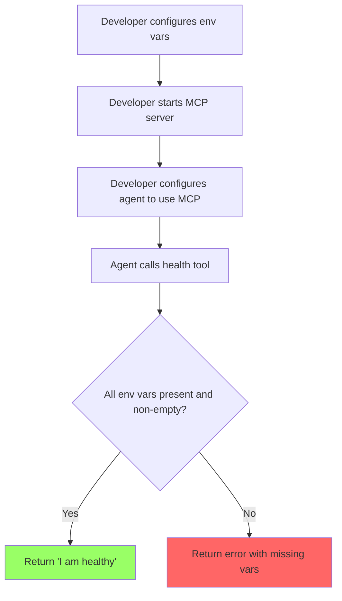

# User Story: Basic FastMCP Server Setup

**Story ID**: CRONTY-1
**Created**: 2025-12-30

## User Persona

A developer integrating Cronty MCP into their AI agent's tool ecosystem.

## Feature Statement

As a developer,
I want a basic FastMCP server with a health check tool
so that my AI agent can verify the server configuration is correct before attempting to schedule notifications.

## Flow Diagram



## Narrative

This story establishes the foundation for the Cronty MCP server. Before implementing scheduling features, we need a working FastMCP server that validates its configuration.

The server requires four environment variables to function:
- `QSTASH_TOKEN` - QStash API token for scheduling
- `QSTASH_CURRENT_SIGNING_KEY` - Current signing key for webhook verification
- `QSTASH_NEXT_SIGNING_KEY` - Next signing key for key rotation
- `NTFY_TOPIC` - NTFY topic for notification delivery

The health tool serves two purposes:
1. **Verification** - Allows an AI agent to confirm the server is running and reachable
2. **Configuration validation** - Ensures all required environment variables are set and non-empty before the agent attempts scheduling operations

This tool may be removed in the future once the core scheduling tools are implemented and stable.

### Project Structure

```
cronty-mcp/
├── server.py          # FastMCP server (entrypoint)
├── pyproject.toml     # Dependencies
├── .env.example       # Environment variable template
└── .gitignore
```

This flat structure is required for FastMCP Cloud deployment.

### Server Implementation

The server should:
1. Import FastMCP and create a server instance named "Cronty MCP"
2. Load environment variables at startup
3. Expose a `health` tool that checks configuration

## Non-functional Requirements

### Loading & Feedback

- Health check should respond immediately (no external API calls)
- Server startup should fail fast if critical configuration is missing

### Error Handling

- Missing environment variables should be listed clearly in the error response
- Empty string values should be treated as missing

## Acceptance Criteria

### Scenario: Server starts successfully with valid configuration

```gherkin
Given all required environment variables are set
  | Variable                     | Value          |
  | QSTASH_TOKEN                 | test-token     |
  | QSTASH_CURRENT_SIGNING_KEY   | current-key    |
  | QSTASH_NEXT_SIGNING_KEY      | next-key       |
  | NTFY_TOPIC                   | test-topic     |
When the MCP server starts
Then the server should initialize without errors
And the health tool should be available
```

### Scenario: Health check passes with all env vars configured

```gherkin
Given the MCP server is running
And all required environment variables are set and non-empty
When the agent calls the health tool
Then the agent should receive "I am healthy"
```

### Scenario: Health check fails when env var is missing

```gherkin
Given the MCP server is running
And QSTASH_TOKEN is not set
When the agent calls the health tool
Then the agent should receive an error
And the error should indicate "QSTASH_TOKEN" is missing
```

### Scenario: Health check fails when env var is empty

```gherkin
Given the MCP server is running
And NTFY_TOPIC is set to an empty string
When the agent calls the health tool
Then the agent should receive an error
And the error should indicate "NTFY_TOPIC" is missing or empty
```

### Scenario: Health check reports multiple missing env vars

```gherkin
Given the MCP server is running
And QSTASH_TOKEN is not set
And NTFY_TOPIC is not set
When the agent calls the health tool
Then the agent should receive an error
And the error should list both "QSTASH_TOKEN" and "NTFY_TOPIC" as missing
```

## Technical Notes

### FastMCP Server Setup

```python
from fastmcp import FastMCP

mcp = FastMCP("Cronty MCP")

@mcp.tool
def health() -> str:
    # Validate env vars and return status
    ...

if __name__ == "__main__":
    mcp.run()
```

### Environment Variables

Create `.env.example` documenting required variables:

```env
QSTASH_TOKEN=
QSTASH_CURRENT_SIGNING_KEY=
QSTASH_NEXT_SIGNING_KEY=
NTFY_TOPIC=
```

### Dependencies

- `fastmcp` - MCP server framework
- `python-dotenv` - Environment variable loading (optional, for local development)
