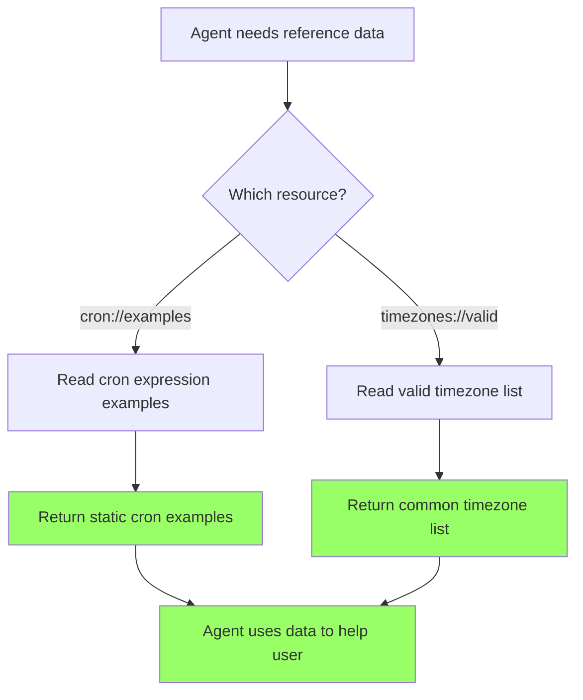

# User Story: Static MCP Resources

**Story ID**: CRONTY-10
**Created**: 2026-01-18

## User Persona

An AI agent (Claude Code, Cursor, or similar) that has Cronty MCP configured and needs reference data for constructing valid cron expressions and timezones.

## Feature Statement

As an AI agent,
I want to access cron examples and timezone references as static MCP resources
so that I can help users construct valid cron expressions and timezones without guessing or making errors.

## Flow Diagram



## Narrative

This story adds static MCP resources to complement the existing tools. Resources are read-only data sources that agents can access without executing actions.

### Resource vs Tool Philosophy

- **Resources**: Read data, no side effects, cacheable
- **Tools**: Perform actions, may have side effects, not cacheable

### Why Only Static Resources?

Dynamic resources (like `schedules://{topic}`) present cache invalidation challenges. MCP clients may cache resource responses, leading to stale data. For schedule data:

- Use the `list_scheduled_notifications` **tool** - always returns fresh data
- See **CRONTY-11** for dynamic resources with cache invalidation via MCP subscriptions

### Two Static Resources

#### 1. `cron://examples`

Common cron expression examples with descriptions. Returns:

```json
{
  "examples": [
    {"expression": "0 9 * * *", "description": "Daily at 9:00 AM"},
    {"expression": "0 9 * * 1-5", "description": "Weekdays at 9:00 AM"},
    ...
  ],
  "format_help": "Fields: minute hour day-of-month month day-of-week"
}
```

#### 2. `timezones://valid`

~22 common IANA timezones grouped by region. Returns:

```json
{
  "timezones": [
    {"zone": "UTC", "region": "Universal"},
    {"zone": "America/New_York", "region": "Americas"},
    {"zone": "Europe/Warsaw", "region": "Europe"},
    {"zone": "Asia/Tokyo", "region": "Asia"},
    ...
  ],
  "count": 22
}
```

## Non-functional Requirements

- Static resources should be instant (hardcoded data)
- Safe to cache indefinitely by MCP clients
- No external dependencies or network calls

## Acceptance Criteria

### Scenario: Read cron examples

```gherkin
Given the MCP server is running
When the agent reads resource "cron://examples"
Then the response should contain a list of cron examples
And each example should have an expression and description
And the response should include format_help explaining the 5 fields
```

### Scenario: Read valid timezones

```gherkin
Given the MCP server is running
When the agent reads resource "timezones://valid"
Then the response should contain a list of common IANA timezones
And each timezone should have a zone and region
And timezones should cover major regions (Americas, Europe, Asia, Oceania)
```

### Scenario: List available resources

```gherkin
Given the MCP server is running
When the agent lists available resources
Then "cron://examples" should be listed with description
And "timezones://valid" should be listed with description
```

## Technical Notes

### Implementation

Use FastMCP's `@mcp.resource()` decorator for static resources. See [FastMCP Resources Guide](https://gofastmcp.com/servers/resources).

### Project Structure

```
cronty-mcp/
├── server.py              # Add resource decorators
├── resources/             # NEW
│   ├── __init__.py
│   └── data.py            # Static resource data (CRON_EXAMPLES, TIMEZONES)
└── tests/
    └── test_resources.py  # NEW
```

### Test Coverage

Add unit tests for:
- Cron examples has required fields (examples, format_help)
- Each example has expression and description
- All expressions are valid 5-field cron
- Timezones has required fields (timezones, count)
- Count matches list length
- Covers major regions (Americas, Europe, Asia, Oceania)
- Includes UTC

## Evaluation

```xml
<qa_pair>
    <question>
        Read the resource "cron://examples" to get cron expression examples.
        Does the response include at least 5 examples, each with an expression and description?
        Answer: Yes or No.
    </question>
    <answer>Yes</answer>
</qa_pair>

<qa_pair>
    <question>
        Read the resource "timezones://valid" to get the list of valid timezones.
        Does the response include timezones from at least 3 different regions?
        Answer: Yes or No.
    </question>
    <answer>Yes</answer>
</qa_pair>
```
