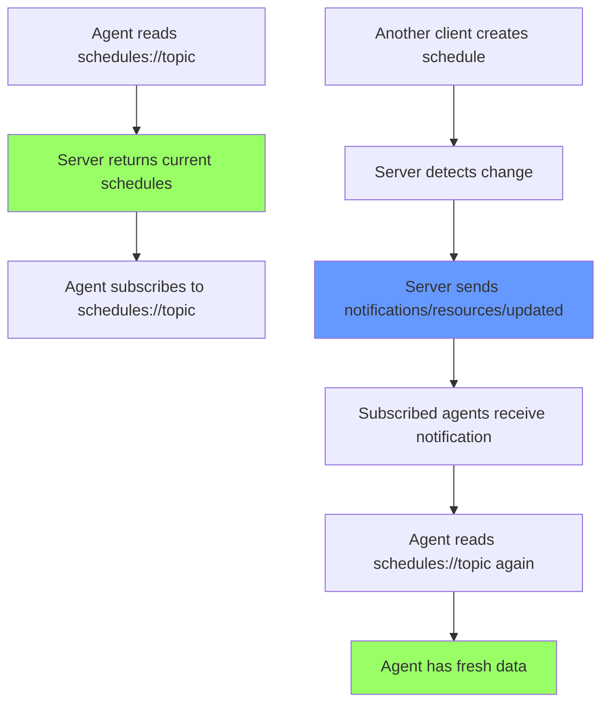

# User Story: Dynamic Schedules Resource with Subscriptions

**Story ID**: CRONTY-11
**Created**: 2026-01-19

## User Persona

An AI agent that wants to read schedule data as a resource and receive real-time updates when schedules change, even when other clients modify the same topic.

## Feature Statement

As an AI agent,
I want to subscribe to schedule resources and receive notifications when they change
so that I can maintain an accurate view of scheduled notifications without polling.

## Flow Diagram



## Narrative

This story implements dynamic MCP resources with cache invalidation using the MCP subscription protocol. It builds on CRONTY-10 by adding `schedules://{topic}` with real-time update notifications.

### The Cache Invalidation Problem

MCP clients may cache resource responses. When schedules are created, deleted, paused, or resumed, cached data becomes stale. The MCP protocol solves this with subscriptions.

### MCP Subscription Protocol

| Message | Direction | Purpose |
|---------|-----------|---------|
| `resources/subscribe` | Client → Server | Subscribe to a resource URI |
| `resources/unsubscribe` | Client → Server | Unsubscribe from a resource URI |
| `notifications/resources/updated` | Server → Client | Resource content changed |
| `notifications/resources/list_changed` | Server → Client | Resource list changed |

### Capability Declaration

Server must declare subscription support:

```json
{
  "capabilities": {
    "resources": {
      "subscribe": true,
      "listChanged": true
    }
  }
}
```

### Tools That Trigger Notifications

| Tool | Notifies |
|------|----------|
| `schedule_cron_notification` | `schedules://{topic}` |
| `delete_schedule` | `schedules://{topic}` |
| `pause_schedule` | `schedules://{topic}` |
| `resume_schedule` | `schedules://{topic}` |

### Multi-Client Scenario

1. **Client A** subscribes to `schedules://team-alerts`
2. **Client B** creates a schedule for `team-alerts`
3. **Server** sends `notifications/resources/updated` with URI `schedules://team-alerts`
4. **Client A** receives notification and can refresh its view

## Non-functional Requirements

- Notifications sent immediately after mutation completes
- Notifications are best-effort (clients may miss if disconnected)
- Resource reads always return fresh data from QStash API
- Clients should handle reconnection and re-subscription

## Acceptance Criteria

### Scenario: Read schedules resource

```gherkin
Given the MCP server is running
And there are schedules for topic "my-alerts"
When the agent reads resource "schedules://my-alerts"
Then the response should contain schedules for "my-alerts" only
And each schedule should include schedule_id, cron_expression, status
```

### Scenario: Subscribe to schedules resource

```gherkin
Given the MCP server declares resources.subscribe: true
When the agent sends resources/subscribe for "schedules://my-alerts"
Then the server should confirm the subscription
```

### Scenario: Notification on schedule creation

```gherkin
Given Client A is subscribed to "schedules://my-alerts"
When Client B creates a schedule for topic "my-alerts"
Then Client A should receive notifications/resources/updated
And the notification URI should be "schedules://my-alerts"
```

### Scenario: Notification on schedule deletion

```gherkin
Given Client A is subscribed to "schedules://my-alerts"
And a schedule exists for topic "my-alerts"
When Client B deletes that schedule
Then Client A should receive notifications/resources/updated
```

### Scenario: Notification on pause/resume

```gherkin
Given Client A is subscribed to "schedules://my-alerts"
And an active schedule exists for topic "my-alerts"
When Client B pauses or resumes that schedule
Then Client A should receive notifications/resources/updated
```

### Scenario: No notification for unrelated topic

```gherkin
Given Client A is subscribed to "schedules://my-alerts"
When Client B creates a schedule for topic "other-topic"
Then Client A should NOT receive a notification
```

### Scenario: Unsubscribe stops notifications

```gherkin
Given Client A is subscribed to "schedules://my-alerts"
When Client A sends resources/unsubscribe for "schedules://my-alerts"
Then Client A should no longer receive notifications for that resource
```

## Technical Notes

### Implementation

Use FastMCP's resource subscription support. Key APIs:
- `@mcp.resource("schedules://{topic}")` - Define resource template
- `ctx.session.send_resource_updated(uri)` - Send update notification

See [MCP Resources Specification](https://modelcontextprotocol.io/specification/2025-06-18/server/resources) and [FastMCP Resources Guide](https://gofastmcp.com/servers/resources).

### Project Structure

```
cronty-mcp/
├── server.py              # Add capability declaration
├── resources/
│   └── schedules.py       # NEW - dynamic schedules resource
├── services/
│   └── notifications.py   # NEW - notification helper
└── tests/
    └── test_subscriptions.py  # NEW
```

### Test Coverage

Add unit tests for:
- Schedule creation triggers notification to subscribed clients
- Schedule deletion triggers notification
- Pause/resume triggers notification
- Notifications only sent to subscribers of affected topic
- Server declares subscribe and listChanged capabilities

## Evaluation

### Basic Evaluation

```xml
<qa_pair>
    <question>
        Create a cron schedule for topic "eval-sub-test" with message "Subscription test"
        and cron "0 0 1 1 *" in UTC timezone.
        Then read the resource "schedules://eval-sub-test".
        Does the resource contain the schedule you just created?
        Answer: Yes or No.
    </question>
    <answer>Yes</answer>
</qa_pair>
```

### Multi-Agent Evaluation (Out of Scope)

An advanced evaluation scenario would test real-time notifications across two different AI agents:

1. **Agent A** (using Anthropic Claude SDK) subscribes to `schedules://shared-topic`
2. **Agent B** (using OpenAI SDK) creates a schedule for `shared-topic`
3. Verify Agent A receives the `notifications/resources/updated` message
4. Agent A re-reads the resource and sees the new schedule

This would demonstrate:
- Cross-client notification delivery
- Multi-vendor MCP client compatibility
- Real-time collaborative workflows

**Why out of scope**: Requires orchestrating two separate MCP client processes, handling async notification delivery, and coordinating test assertions across processes. This is valuable for demonstrating MCP's collaborative potential but adds significant complexity.

**Future consideration**: Could be implemented as an integration test using pytest-asyncio with two FastMCP client instances, or as a manual demo script.

## Learning Goals

This story builds MCP expertise in:
- Resource subscriptions and the MCP notification protocol
- Cache invalidation patterns for dynamic data
- Multi-client coordination and event-driven architecture
- Server capability negotiation

## References

- [MCP Resources Specification](https://modelcontextprotocol.io/specification/2025-06-18/server/resources)
- [FastMCP Resources Guide](https://gofastmcp.com/servers/resources)
- [MCP Message Types Reference](https://portkey.ai/blog/mcp-message-types-complete-json-rpc-reference-guide/)
