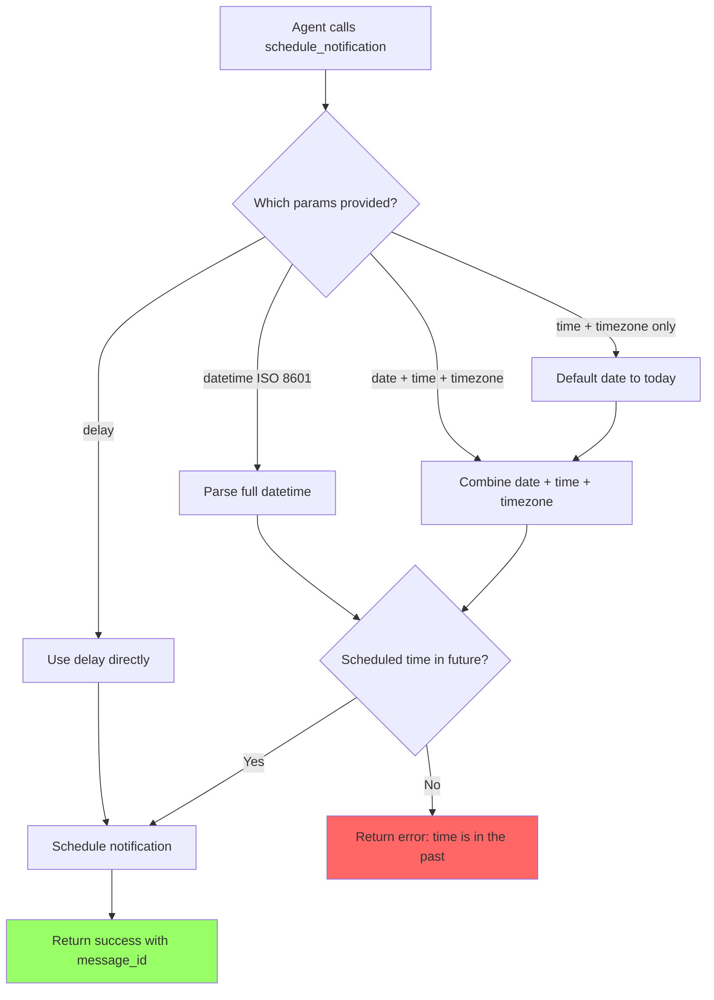

# User Story: Default Date to Today for Time-Only Scheduling

**Story ID**: CRONTY-12
**Created**: 2026-01-21

## User Persona

An AI agent (Claude Code, Cursor, Obsidian Life Navigator) scheduling notifications on behalf of users through the Cronty MCP server.

## Feature Statement

As an AI agent,
I want to schedule a notification with just time and timezone (without specifying a date)
so that I can more naturally handle user requests like "remind me at 2pm" without requiring the full date parameter.

## Flow Diagram



## Narrative

### Problem

When agents want to schedule notifications for today, they often provide only the time and timezone, expecting the system to infer "today" as the date. Currently, the `schedule_notification` tool requires all three parameters (date, time, timezone) when using the separate parameters mode, resulting in a validation error:

```
Missing required parameters: date. date, time, and timezone are all required.
```

This forces agents to make an additional call to determine the current date before scheduling, adding unnecessary friction to the most common use case: scheduling something for later today.

### Solution

When the agent provides `time` and `timezone` but omits `date`, the system should default to today's date in the specified timezone. This makes the API more intuitive for the common case of scheduling same-day notifications.

### Behavior

1. **time + timezone provided, date omitted**: Default date to today (in the specified timezone)
2. **date + time + timezone all provided**: Use the explicit date (existing behavior)
3. **datetime ISO 8601**: Require full datetime (no change)
4. **delay**: Use delay directly (no change)

### Timezone Handling for Date Default

The "today" date must be calculated in the **specified timezone**, not UTC. For example:
- At 2026-01-21 23:30 UTC, if timezone is `Europe/Warsaw` (UTC+1), today is 2026-01-22
- At 2026-01-21 00:30 UTC, if timezone is `America/New_York` (UTC-5), today is 2026-01-20

### Edge Case: Time Already Passed Today

If the agent requests a time that has already passed today (in the specified timezone), the tool should return an error rather than automatically scheduling for tomorrow. This keeps the behavior explicit and avoids surprising the user.

## Non-functional Requirements

### Loading & Feedback

- No change to response time - date defaulting is a simple operation
- Response should include the resolved date for clarity

### Error Handling

- If time has already passed today, return clear error with current time for reference
- Existing validation for invalid time format and timezone remains unchanged

### Reliability

- Date calculation must respect the timezone parameter to avoid off-by-one errors at day boundaries

## Acceptance Criteria

### Scenario: Schedule notification with time and timezone only (date defaults to today)

```gherkin
Given the MCP server is running with valid configuration
And the current date in Europe/Warsaw is 2026-01-21
When the agent calls schedule_notification with:
  | Parameter          | Value              |
  | message            | Interview reminder |
  | time               | 13:55              |
  | timezone           | Europe/Warsaw      |
  | notification_topic | my-alerts          |
Then the tool should return a success response
And the response should include a confirmation message
And the response should include the QStash message ID
And the confirmation should show "2026-01-21 13:55 Europe/Warsaw"
```

### Scenario: Reject time-only scheduling when time has already passed today

```gherkin
Given the MCP server is running
And the current time in Europe/Warsaw is 2026-01-21 14:00
When the agent calls schedule_notification with:
  | Parameter          | Value         |
  | message            | Too late      |
  | time               | 13:00         |
  | timezone           | Europe/Warsaw |
  | notification_topic | my-alerts     |
Then the tool should return an error
And the error should indicate the scheduled time is in the past
And the error should include the current system time for reference
```

### Scenario: Date defaults correctly across timezone boundaries

```gherkin
Given the MCP server is running
And the current UTC time is 2026-01-21 23:30 (which is 2026-01-22 00:30 in Europe/Warsaw)
When the agent calls schedule_notification with:
  | Parameter          | Value         |
  | message            | Late night    |
  | time               | 01:00         |
  | timezone           | Europe/Warsaw |
  | notification_topic | my-alerts     |
Then the date should default to 2026-01-22 (today in Europe/Warsaw)
And the tool should return a success response
And the confirmation should show "2026-01-22 01:00 Europe/Warsaw"
```

### Scenario: Time-only with only time parameter (missing timezone)

```gherkin
Given the MCP server is running
When the agent calls schedule_notification with:
  | Parameter          | Value     |
  | message            | Test      |
  | time               | 13:00     |
  | notification_topic | my-alerts |
Then the tool should return an error
And the error should indicate timezone is required
```

## Evaluation Test Case

Add the following test to `evaluation.xml`:

```xml
<qa_pair>
    <question>
        Schedule a one-off notification with only time and timezone (no date) to test the default-to-today feature.
        Use message "Time-only test at {current_time}" to topic "cronty-eval-test" with time "23:59" and timezone "UTC".
        Replace the `{current_time}` placeholder with the current time in UTC.
        Was the notification scheduled successfully with today's date? Answer: Yes or No.</question>
    <answer>Yes</answer>
</qa_pair>
```
