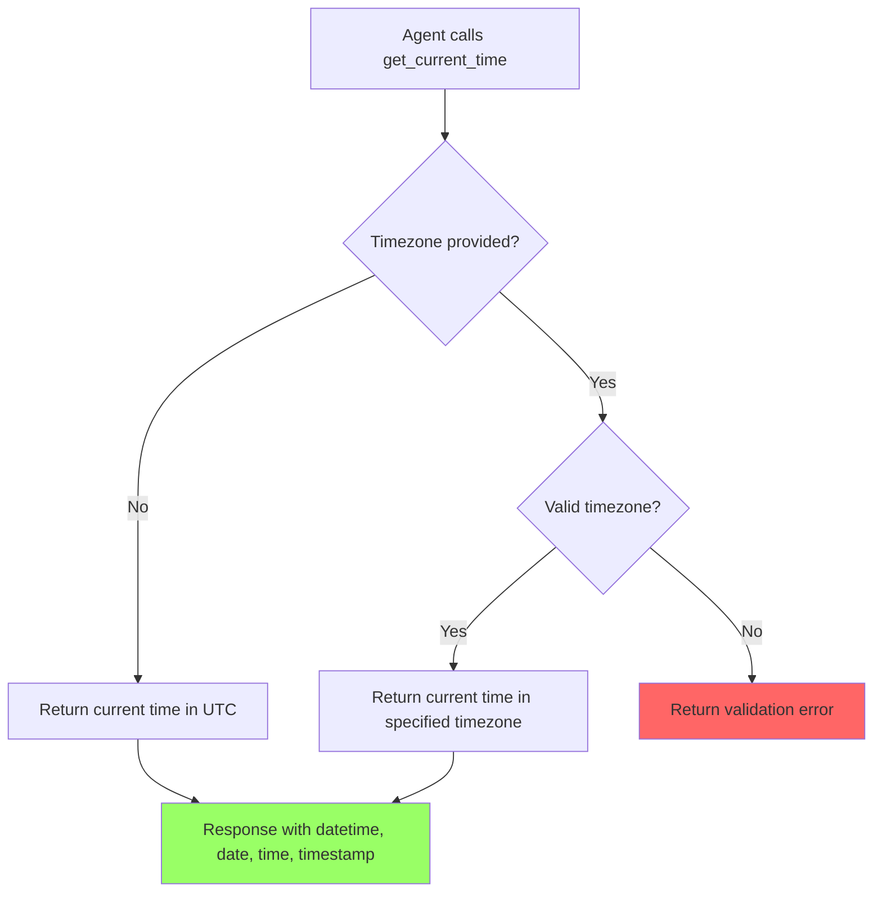

# User Story: Get Current Time Tool

**Story ID**: CRONTY-13
**Created**: 2026-01-22

## User Persona

An AI agent (Claude Code, Cursor, Obsidian Life Navigator) that needs to know the current date and time to schedule notifications or provide time-aware responses.

## Feature Statement

As an AI agent,
I want to get the current date and time in UTC or a specific timezone
so that I can accurately schedule notifications and make time-based decisions.

## Flow Diagram



## Narrative

### Problem

The current `health` tool serves two purposes:
1. Check if the server is configured correctly
2. Return the current UTC time

This is confusing for agents because:
- The tool name doesn't indicate it returns the current time
- Agents need to call "health" just to get the current date/time
- There's no way to get time in a specific timezone

### Solution

Replace the `health` tool with a dedicated `get_current_time` tool that:
1. Returns the current date and time
2. Accepts an optional timezone parameter (defaults to UTC)
3. Returns time in multiple useful formats

### Response Format

The tool returns a structured response with:
- `datetime`: ISO 8601 format with timezone (e.g., `2026-01-22T14:30:00+01:00`)
- `date`: Date in YYYY-MM-DD format (e.g., `2026-01-22`)
- `time`: Time in HH:MM:SS format (e.g., `14:30:00`)
- `timezone`: The timezone used (e.g., `Europe/Warsaw` or `UTC`)
- `timestamp_ms`: Unix timestamp in milliseconds for precise calculations

### Migration

- Remove the `health` tool entirely
- Server configuration is validated at startup (existing behavior)
- Update evaluations that used `health` to use `get_current_time`

## Non-functional Requirements

### Loading & Feedback

- Response should be instant (no external API calls)
- No blocking operations

### Error Handling

- Invalid timezone returns clear error with examples of valid timezones
- Reference the `timezones://valid` resource for valid timezone list

## Acceptance Criteria

### Scenario: Get current time in UTC (default)

```gherkin
Given the MCP server is running
When the agent calls get_current_time without parameters
Then the tool should return a success response
And the response should include datetime in ISO 8601 format
And the response should include date in YYYY-MM-DD format
And the response should include time in HH:MM:SS format
And the response should include timezone as "UTC"
And the response should include timestamp_ms as a Unix timestamp in milliseconds
```

### Scenario: Get current time in specific timezone

```gherkin
Given the MCP server is running
When the agent calls get_current_time with timezone "Europe/Warsaw"
Then the tool should return a success response
And the datetime should be in Europe/Warsaw timezone
And the timezone field should show "Europe/Warsaw"
```

### Scenario: Invalid timezone

```gherkin
Given the MCP server is running
When the agent calls get_current_time with timezone "Invalid/Zone"
Then the tool should return an error
And the error should indicate the timezone is invalid
And the error should suggest checking the timezones://valid resource
```

### Scenario: Health tool removed

```gherkin
Given the MCP server is running
When the agent lists available tools
Then the tool list should NOT include "health"
And the tool list should include "get_current_time"
```

## Evaluation Updates

Update evaluation.xml to replace health tool usage:

### Task 1: Server Status Check
**Before:**
```xml
<question>Use the health tool to check the server status.
Is the server configured correctly? Answer: Yes or No.</question>
```

**After:**
```xml
<question>Use the get_current_time tool to verify the server is running.
Does the response include the current date and time? Answer: Yes or No.</question>
```

### Task 10: Default Date Test
**Before:**
```xml
<question>First, use the health tool to get the current date and time in UTC...</question>
```

**After:**
```xml
<question>First, use the get_current_time tool to get the current date and time in UTC...</question>
```
