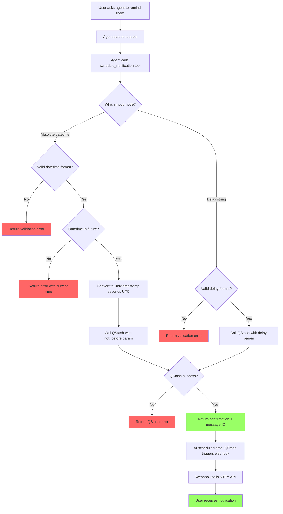

# User Story: Schedule One-Off Notification

**Story ID**: CRONTY-2
**Created**: 2025-12-31

## User Persona

An end user interacting with an AI agent (Claude Code, Cursor, Obsidian Life Navigator) that has Cronty MCP configured.

## Feature Statement

As an end user,
I want to ask my AI agent to remind me about something at a specific future time or after a delay
so that I receive a push notification on my device without needing to remember the task myself.

## Flow Diagram



## Narrative

This story implements the core P0 feature: scheduling one-off notifications. When a user says "remind me to call mom tomorrow at 3pm" or "remind me in 2 hours to take a break," the AI agent parses this and calls the Cronty MCP tool.

### Input Modes

The tool supports three input modes:

1. **ISO 8601 datetime**: `2025-01-15T09:00:00+01:00` or `2025-01-15T09:00:00Z`
2. **Separate parameters**: date (`2025-01-15`), time (`09:00`), timezone (`Europe/Warsaw`)
3. **Delay string**: QStash format with units in order d > h > m > s (e.g., `"1d"`, `"2h30m"`, `"1d10h30m"`, `"50s"`)

The agent is responsible for parsing natural language into one of these formats. The MCP tool only handles structured input.

### QStash Scheduling with Upstash-Not-Before

QStash supports the `Upstash-Not-Before` header which accepts a Unix timestamp in seconds (UTC). This is simpler than calculating delays:

1. Parse the target datetime (from ISO 8601 or separate params)
2. Convert to UTC Unix timestamp in seconds
3. Pass to QStash via `Upstash-Not-Before` header

For delay-based input:
1. Validate the delay string format (must match `^(?=.)(\d+d)?(\d+h)?(\d+m)?(\d+s)?$`)
2. Pass directly to QStash via `delay` parameter (SDK accepts string format)

### Timezone Handling

- ISO 8601 format: timezone is embedded in the string
- Separate parameters: timezone parameter is required (IANA format, e.g., `Europe/Warsaw`)
- Delay format: no timezone needed, calculated from current UTC time

### Message Content

Messages are plain text only. The tool passes the message directly to NTFY without modification.

### NTFY Delivery

QStash will call the NTFY webhook at the scheduled time:
```
https://ntfy.sh/{NTFY_TOPIC}
```

QStash handles retries automatically if NTFY is temporarily unavailable.

## Non-functional Requirements

### Loading & Feedback

- Tool response should be immediate (QStash publish is fast)
- The tool does not wait for the notification to be delivered

### Error Handling

- Invalid datetime format returns clear parsing error
- Past datetime returns error with current system time for reference
- Invalid delay format returns validation error with valid format examples
- QStash API errors are passed through with context

### Reliability

- QStash provides at-least-once delivery guarantee
- NTFY delivery depends on user's NTFY client connectivity

## Acceptance Criteria

### Scenario: Schedule notification with ISO 8601 datetime

```gherkin
Given the MCP server is running with valid configuration
When the agent calls schedule_notification with:
  | Parameter | Value                      |
  | message   | Call mom                   |
  | datetime  | 2025-01-15T09:00:00+01:00  |
Then the tool should return a success response
And the response should include a confirmation message
And the response should include the QStash message ID
And the confirmation should show the scheduled time
```

### Scenario: Schedule notification with separate date, time, timezone

```gherkin
Given the MCP server is running with valid configuration
When the agent calls schedule_notification with:
  | Parameter | Value          |
  | message   | Team standup   |
  | date      | 2025-01-15     |
  | time      | 09:00          |
  | timezone  | Europe/Warsaw  |
Then the tool should return a success response
And the response should include a confirmation message
And the response should include the QStash message ID
And the confirmation should show "2025-01-15 09:00 Europe/Warsaw"
```

### Scenario: Schedule notification with delay string

```gherkin
Given the MCP server is running with valid configuration
When the agent calls schedule_notification with:
  | Parameter | Value              |
  | message   | Follow up on email |
  | delay     | 3d                 |
Then the tool should return a success response
And the response should include a confirmation message
And the response should include the QStash message ID
```

### Scenario: Schedule notification with combined delay units

```gherkin
Given the MCP server is running with valid configuration
When the agent calls schedule_notification with:
  | Parameter | Value          |
  | message   | Check progress |
  | delay     | 1d10h30m       |
Then the tool should return a success response
And the response should include the QStash message ID
```

### Scenario: Reject scheduling in the past

```gherkin
Given the MCP server is running
And the current system time is 2025-01-15T10:00:00+01:00
When the agent calls schedule_notification with:
  | Parameter | Value                      |
  | message   | Too late                   |
  | datetime  | 2025-01-15T09:00:00+01:00  |
Then the tool should return an error
And the error should indicate the scheduled time is in the past
And the error should include the current system time for reference
```

### Scenario: Invalid ISO 8601 format

```gherkin
Given the MCP server is running
When the agent calls schedule_notification with:
  | Parameter | Value          |
  | message   | Test           |
  | datetime  | not-a-datetime |
Then the tool should return an error
And the error should indicate invalid datetime format
```

### Scenario: Invalid delay format (invalid unit)

```gherkin
Given the MCP server is running
When the agent calls schedule_notification with:
  | Parameter | Value  |
  | message   | Test   |
  | delay     | 3weeks |
Then the tool should return an error
And the error should indicate invalid delay format
And the error should show valid format examples: "1d", "2h30m", "1d10h30m50s"
```

### Scenario: Invalid delay format (wrong order)

```gherkin
Given the MCP server is running
When the agent calls schedule_notification with:
  | Parameter | Value |
  | message   | Test  |
  | delay     | 30m1d |
Then the tool should return an error
And the error should indicate units must be in order: d, h, m, s
```

### Scenario: Missing timezone in separate parameters

```gherkin
Given the MCP server is running
When the agent calls schedule_notification with:
  | Parameter | Value       |
  | message   | Test        |
  | date      | 2025-01-15  |
  | time      | 09:00       |
Then the tool should return an error
And the error should indicate timezone is required
```

### Scenario: Invalid timezone identifier

```gherkin
Given the MCP server is running
When the agent calls schedule_notification with:
  | Parameter | Value          |
  | message   | Test           |
  | date      | 2025-01-15     |
  | time      | 09:00          |
  | timezone  | Not/A/Timezone |
Then the tool should return an error
And the error should indicate invalid timezone
```

### Scenario: Conflicting input parameters

```gherkin
Given the MCP server is running
When the agent calls schedule_notification with:
  | Parameter | Value                      |
  | message   | Test                       |
  | datetime  | 2025-01-15T09:00:00+01:00  |
  | delay     | 3d                         |
Then the tool should return an error
And the error should indicate only one scheduling mode allowed
```

### Scenario: Notification delivered at scheduled time

```gherkin
Given a notification was scheduled for 2025-01-15T09:00:00+01:00
When the scheduled time arrives
Then QStash should trigger the NTFY webhook
And the user should receive the notification with the original message
```

## Technical Notes

### Tool Signature

Uses FastMCP with Pydantic `Field` validators via `Annotated` types:

```python
from typing import Annotated
from pydantic import Field

# Regex: enforces d > h > m > s order, at least one unit required
DELAY_PATTERN = r'^(?=.)(\d+d)?(\d+h)?(\d+m)?(\d+s)?$'

@mcp.tool
def schedule_notification(
    message: Annotated[str, Field(description="The notification text to send")],
    datetime: Annotated[
        str | None,
        Field(description="ISO 8601 datetime with timezone (e.g., 2025-01-15T09:00:00+01:00)")
    ] = None,
    date: Annotated[
        str | None,
        Field(description="Date in YYYY-MM-DD format", pattern=r'^\d{4}-\d{2}-\d{2}$')
    ] = None,
    time: Annotated[
        str | None,
        Field(description="Time in HH:MM format", pattern=r'^\d{2}:\d{2}$')
    ] = None,
    timezone: Annotated[
        str | None,
        Field(description="IANA timezone (e.g., Europe/Warsaw)")
    ] = None,
    delay: Annotated[
        str | None,
        Field(description="QStash delay format (e.g., 1d, 2h30m, 1d10h30m)", pattern=DELAY_PATTERN)
    ] = None,
) -> dict:
    """Schedule a one-off notification for a future time.

    Supports three input modes (use only one):
    1. datetime: ISO 8601 format (e.g., 2025-01-15T09:00:00+01:00)
    2. date + time + timezone: Separate parameters
    3. delay: QStash delay format (e.g., 1d, 2h30m, 1d10h30m50s)
    """
```

### Validation via Pydantic Field

FastMCP uses Pydantic's `Field` for parameter validation:

| Parameter | Validation |
|-----------|------------|
| `date` | Pattern: `^\d{4}-\d{2}-\d{2}$` |
| `time` | Pattern: `^\d{2}:\d{2}$` |
| `delay` | Pattern: `^(?=.)(\d+d)?(\d+h)?(\d+m)?(\d+s)?$` |

Valid delay examples: `"1d"`, `"2h30m"`, `"1d10h30m"`, `"50s"`
Invalid delay examples: `"30m1d"` (wrong order), `"3weeks"` (invalid unit)

### QStash Python SDK Integration

The QStash SDK natively supports both scheduling modes via `publish_json`:

```python
from qstash import QStash

client = QStash(token=config.QSTASH_TOKEN)

# Mode 1: Absolute datetime using not_before (Unix timestamp in seconds, UTC)
response = client.message.publish_json(
    url=f"https://ntfy.sh/{config.NTFY_TOPIC}",
    body=message,
    not_before=1736931600,  # Unix timestamp in seconds, UTC
)

# Mode 2: Relative delay using string format
response = client.message.publish_json(
    url=f"https://ntfy.sh/{config.NTFY_TOPIC}",
    body=message,
    delay="1d10h30m",  # QStash delay format
)
```

### SDK Parameter Reference

| Parameter | Type | Description |
|-----------|------|-------------|
| `delay` | `str \| int` | Delay string (`"1d"`, `"2h30m"`) or seconds as int |
| `not_before` | `int` | Unix timestamp in seconds (UTC) |

### Project Structure Update

```
cronty-mcp/
├── server.py
├── config.py
├── tools/
│   ├── __init__.py
│   ├── health.py
│   └── schedule.py      # NEW
├── services/
│   ├── __init__.py
│   ├── qstash.py        # NEW
│   └── ntfy.py
└── tests/
    ├── test_health.py
    └── test_schedule.py  # NEW
```

### Dependencies

Add to `pyproject.toml`:
- `qstash` - Upstash QStash Python SDK
