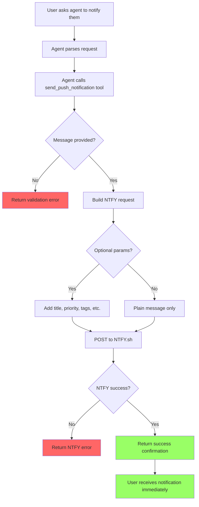

# User Story: Send Push Notification

**Story ID**: CRONTY-3
**Created**: 2026-01-01

## User Persona

An end user interacting with an AI agent (Claude Code, Cursor, Obsidian Life Navigator) that has Cronty MCP configured.

## Feature Statement

As an end user,
I want to ask my AI agent to send me a push notification right now
so that I receive an immediate alert on my device without any delay.

## Flow Diagram



## Narrative

This story implements immediate push notification delivery. Unlike CRONTY-2 which schedules notifications for the future via QStash, this feature sends notifications directly for instant delivery. When a user says "send me a notification that the build finished" or "alert me now that the server is down," the agent calls this tool and the user receives the notification within seconds.

### Tool Naming

The tool is named `send_push_notification` rather than referencing NTFY directly. This leaves room for a future generic `send_notification` tool that could accept a notification type parameter and route to different channels (push, email, SMS, etc.). That extensibility is out of scope for this story.

### Direct NTFY Integration

For this implementation, push notifications are delivered via NTFY.sh. The tool bypasses QStash entirely and calls the NTFY.sh API directly. This is simpler for immediate notifications and reduces latency since there's no intermediary scheduling service.

### Input Parameters

The tool supports the full range of NTFY features, all optional except message:

**Required:**
- `message`: The notification body text

**Optional - Display:**
- `title`: Notification title (appears prominently)
- `priority`: 1 (min) to 5 (max/urgent) - controls vibration/sound behavior
- `tags`: List of tags that can render as emojis (e.g., `["warning", "skull"]`)
- `markdown`: Enable markdown formatting in the message body

**Optional - Actions:**
- `click`: URL to open when notification is tapped
- `actions`: Up to 3 action buttons with view/http/broadcast types

**Optional - Media:**
- `icon`: Custom notification icon URL
- `attach`: URL of file to attach
- `filename`: Custom filename for attachment

The agent is free to use as few or as many parameters as appropriate for the user's request. A simple "notify me" uses just the message, while "send me an urgent alert with a link to the dashboard" would use message, priority, title, and click.

### NTFY Topic

The notification is always sent to the server's configured `NTFY_TOPIC` from environment variables. Users configure their NTFY client to subscribe to this topic.

### Priority Levels

| Level | Name | Behavior |
|-------|------|----------|
| 5 | max/urgent | Long vibration bursts, popup notification |
| 4 | high | Long vibration burst with popup |
| 3 | default | Standard vibration and sound |
| 2 | low | No vibration/sound, drawer-only |
| 1 | min | No alerts, hidden in "Other notifications" |

### Tags and Emojis

Tags appear below the notification title. Many tag names automatically render as emojis:
- `warning` renders as warning triangle
- `white_check_mark` renders as checkmark
- `skull` renders as skull
- Custom tags like `server1` appear as text

### Action Buttons

Up to 3 action buttons can be added. Each action has:
- `action`: Type (`view`, `http`, `broadcast`)
- `label`: Button text
- `url`: Target URL (for view/http types)
- `method`: HTTP method (for http type, defaults to POST)
- `headers`: Optional headers (for http type)
- `body`: Optional body (for http type)

Example: A "View Dashboard" button that opens a URL when tapped.

## Non-functional Requirements

### Loading & Feedback

- Tool response should be immediate (direct HTTP POST to NTFY)
- Notification delivery to user's device typically occurs within 1-2 seconds

### Error Handling

- Missing message returns clear validation error
- Invalid priority (outside 1-5) returns validation error
- NTFY API errors are passed through with context
- Network errors return connection failure message

### Reliability

- No retry logic - errors return immediately to the agent
- NTFY.sh has high availability but no delivery guarantee is made
- Agent can retry if needed based on error response

## Acceptance Criteria

### Scenario: Send simple notification with message only

```gherkin
Given the MCP server is running with valid configuration
When the agent calls send_push_notification with:
  | Parameter | Value           |
  | message   | Build completed |
Then the tool should return a success response
And the user should receive a notification with body "Build completed"
```

### Scenario: Send notification with title and message

```gherkin
Given the MCP server is running with valid configuration
When the agent calls send_push_notification with:
  | Parameter | Value                    |
  | message   | All tests passed         |
  | title     | CI Pipeline              |
Then the tool should return a success response
And the user should receive a notification with title "CI Pipeline"
And the notification body should be "All tests passed"
```

### Scenario: Send urgent notification with high priority

```gherkin
Given the MCP server is running with valid configuration
When the agent calls send_push_notification with:
  | Parameter | Value                    |
  | message   | Server is unresponsive   |
  | title     | Alert                    |
  | priority  | 5                        |
  | tags      | ["warning", "skull"]     |
Then the tool should return a success response
And the user should receive an urgent notification with popup
And the notification should display warning and skull emojis
```

### Scenario: Send notification with click action

```gherkin
Given the MCP server is running with valid configuration
When the agent calls send_push_notification with:
  | Parameter | Value                           |
  | message   | New deployment ready for review |
  | click     | https://dashboard.example.com   |
Then the tool should return a success response
And tapping the notification should open the dashboard URL
```

### Scenario: Send notification with action buttons

```gherkin
Given the MCP server is running with valid configuration
When the agent calls send_push_notification with:
  | Parameter | Value                                                    |
  | message   | PR #123 needs review                                     |
  | actions   | [{"action": "view", "label": "Open PR", "url": "https://github.com/org/repo/pull/123"}] |
Then the tool should return a success response
And the notification should have an "Open PR" button
And tapping the button should open the PR URL
```

### Scenario: Send notification with markdown formatting

```gherkin
Given the MCP server is running with valid configuration
When the agent calls send_push_notification with:
  | Parameter | Value                              |
  | message   | **Build failed** for `main` branch |
  | markdown  | true                               |
Then the tool should return a success response
And the notification should render with bold and code formatting
```

### Scenario: Send notification with attachment

```gherkin
Given the MCP server is running with valid configuration
When the agent calls send_push_notification with:
  | Parameter | Value                              |
  | message   | Screenshot of the error            |
  | attach    | https://example.com/screenshot.png |
  | filename  | error.png                          |
Then the tool should return a success response
And the notification should include the image attachment
```

### Scenario: Send notification with custom icon

```gherkin
Given the MCP server is running with valid configuration
When the agent calls send_push_notification with:
  | Parameter | Value                              |
  | message   | Deployment successful              |
  | icon      | https://example.com/deploy-icon.png|
Then the tool should return a success response
And the notification should display the custom icon
```

### Scenario: Missing message parameter

```gherkin
Given the MCP server is running
When the agent calls send_push_notification with no parameters
Then the tool should return an error
And the error should indicate message is required
```

### Scenario: Invalid priority value

```gherkin
Given the MCP server is running
When the agent calls send_push_notification with:
  | Parameter | Value   |
  | message   | Test    |
  | priority  | 10      |
Then the tool should return an error
And the error should indicate priority must be between 1 and 5
```

### Scenario: NTFY service unavailable

```gherkin
Given the MCP server is running
And NTFY.sh is unreachable
When the agent calls send_push_notification with:
  | Parameter | Value      |
  | message   | Test       |
Then the tool should return an error
And the error should indicate connection failure to NTFY
```

### Scenario: Send notification with all optional parameters

```gherkin
Given the MCP server is running with valid configuration
When the agent calls send_push_notification with:
  | Parameter | Value                                                    |
  | message   | **Full featured** notification test                      |
  | title     | Complete Test                                            |
  | priority  | 4                                                        |
  | tags      | ["white_check_mark", "test"]                             |
  | markdown  | true                                                     |
  | click     | https://example.com                                      |
  | icon      | https://example.com/icon.png                             |
  | actions   | [{"action": "view", "label": "View", "url": "https://example.com"}] |
Then the tool should return a success response
And all notification features should be correctly applied
```

## Technical Notes

### Tool Signature

```python
from typing import Annotated
from pydantic import Field

@mcp.tool
def send_push_notification(
    message: Annotated[str, Field(description="The notification body text")],
    title: Annotated[str | None, Field(description="Notification title")] = None,
    priority: Annotated[int | None, Field(description="Priority 1-5 (1=min, 3=default, 5=urgent)", ge=1, le=5)] = None,
    tags: Annotated[list[str] | None, Field(description="List of tags/emoji shortcodes")] = None,
    markdown: Annotated[bool | None, Field(description="Enable markdown formatting")] = None,
    click: Annotated[str | None, Field(description="URL to open when notification is tapped")] = None,
    icon: Annotated[str | None, Field(description="URL of custom notification icon")] = None,
    attach: Annotated[str | None, Field(description="URL of file to attach")] = None,
    filename: Annotated[str | None, Field(description="Filename for attachment")] = None,
    actions: Annotated[list[dict] | None, Field(description="Action buttons (max 3)")] = None,
) -> dict:
    """Send an immediate push notification.

    Sends a push notification for instant delivery (currently via NTFY.sh).
    Only message is required; all other parameters are optional.
    """
```

### NTFY API Integration

Direct HTTP POST to NTFY using JSON format:

```python
import httpx

async def send_ntfy_notification(
    topic: str,
    message: str,
    title: str | None = None,
    priority: int | None = None,
    tags: list[str] | None = None,
    markdown: bool | None = None,
    click: str | None = None,
    icon: str | None = None,
    attach: str | None = None,
    filename: str | None = None,
    actions: list[dict] | None = None,
) -> dict:
    payload = {"topic": topic, "message": message}

    if title:
        payload["title"] = title
    if priority:
        payload["priority"] = priority
    if tags:
        payload["tags"] = tags
    if markdown:
        payload["markdown"] = markdown
    if click:
        payload["click"] = click
    if icon:
        payload["icon"] = icon
    if attach:
        payload["attach"] = attach
    if filename:
        payload["filename"] = filename
    if actions:
        payload["actions"] = actions

    async with httpx.AsyncClient() as client:
        response = await client.post("https://ntfy.sh", json=payload)
        response.raise_for_status()
        return response.json()
```

### Comparison with CRONTY-2

| Aspect | CRONTY-2 (Schedule) | CRONTY-3 (Immediate) |
|--------|---------------------|----------------------|
| Delivery | Future (scheduled) | Immediate |
| Service | QStash -> NTFY | NTFY directly |
| Scheduling params | datetime, delay, etc. | None |
| NTFY features | Message only | Full (title, priority, tags, actions, etc.) |
| Use case | "Remind me in 2 hours" | "Notify me now" |

### Project Structure Update

```
cronty-mcp/
├── server.py
├── config.py
├── tools/
│   ├── __init__.py
│   ├── health.py
│   ├── schedule.py           # CRONTY-2
│   └── push_notification.py  # NEW - CRONTY-3
├── services/
│   ├── __init__.py
│   ├── qstash.py             # CRONTY-2
│   └── ntfy.py               # NEW - CRONTY-3
└── tests/
    ├── test_health.py
    ├── test_schedule.py           # CRONTY-2
    └── test_push_notification.py  # NEW - CRONTY-3
```

### Dependencies

Add to `pyproject.toml`:
- `httpx` - Async HTTP client for NTFY API calls
