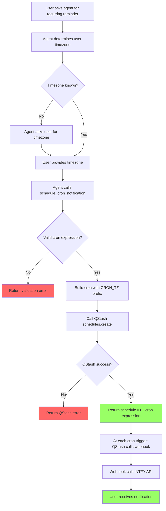

# User Story: Schedule Cron Notification

**Story ID**: CRONTY-4
**Created**: 2026-01-01

## User Persona

An end user interacting with an AI agent (Claude Code, Cursor, Obsidian Life Navigator) that has Cronty MCP configured.

## Feature Statement

As an end user,
I want to ask my AI agent to set up recurring notifications using cron syntax
so that I receive regular push notifications on my device without manual intervention.

## Flow Diagram



## Narrative

This story implements the P0 cron scheduling feature from the PRD. When a user says "remind me every Monday at 9am to submit my timesheet" or "send me a daily standup reminder at 8:30am," the AI agent parses this into a cron expression and calls the Cronty MCP tool.

### Cron Expression with Timezone

QStash supports timezone-aware cron expressions using the `CRON_TZ=` prefix:

```
CRON_TZ=Europe/Warsaw 0 9 * * 1
```

This schedules the job to run every Monday at 9:00 AM in the Europe/Warsaw timezone.

The tool accepts two parameters:
- `cron`: Standard 5-field cron expression (e.g., `0 9 * * 1`)
- `timezone`: IANA timezone identifier (e.g., `Europe/Warsaw`)

The tool combines these into the QStash format internally.

### Agent Timezone Discovery

The tool description instructs agents to:
1. First check the user's system timezone (via system info, locale, or environment)
2. If timezone cannot be determined, ask the user explicitly
3. Use IANA timezone format (e.g., `Europe/Warsaw`, `America/New_York`)

Example timezones are provided in the tool description to guide agents on valid formats.

### Optional Label

An optional `label` parameter allows agents to provide a human-readable identifier for filtering logs in the Upstash dashboard. This helps users find and identify their scheduled notifications when reviewing QStash logs.

### Message Content

Messages are plain text only. The tool passes the message directly to NTFY without modification.

### QStash Schedules API

Unlike one-off notifications that use `message.publish_json`, recurring schedules use the QStash Schedules API:

```python
response = client.schedule.create(
    destination=f"https://ntfy.sh/{config.NTFY_TOPIC}",
    cron="CRON_TZ=Europe/Warsaw 0 9 * * 1",
    body=message,
)
```

This creates a persistent schedule that fires according to the cron pattern. The schedule continues indefinitely until deleted via the Upstash panel.

### Management via Upstash Panel

For MVP, schedule management (listing, pausing, deleting) is done through the Upstash QStash dashboard. The tool only handles creation.

## Non-functional Requirements

### Loading & Feedback

- Tool response should be immediate (QStash schedule creation is fast)
- The tool does not wait for the first notification to be delivered

### Error Handling

- Invalid cron expression returns clear validation error with format guidance
- Invalid timezone returns error with example valid timezones
- QStash API errors are passed through with context

### Reliability

- QStash provides at-least-once delivery guarantee per trigger
- Schedules persist in QStash and survive MCP server restarts
- NTFY delivery depends on user's NTFY client connectivity

## Acceptance Criteria

### Scenario: Schedule recurring notification with timezone

```gherkin
Given the MCP server is running with valid configuration
When the agent calls schedule_cron_notification with:
  | Parameter | Value                     |
  | message   | Submit your timesheet     |
  | cron      | 0 9 * * 1                 |
  | timezone  | Europe/Warsaw             |
Then the tool should return a success response
And the response should include the QStash schedule ID
And the response should include the cron expression with timezone
```

### Scenario: Schedule with optional label

```gherkin
Given the MCP server is running with valid configuration
When the agent calls schedule_cron_notification with:
  | Parameter | Value                     |
  | message   | Daily standup reminder    |
  | cron      | 30 8 * * 1-5              |
  | timezone  | America/New_York          |
  | label     | standup-reminder          |
Then the tool should return a success response
And the schedule should be created with the provided label for log filtering
```

### Scenario: Invalid cron expression

```gherkin
Given the MCP server is running
When the agent calls schedule_cron_notification with:
  | Parameter | Value           |
  | message   | Test            |
  | cron      | not-a-cron      |
  | timezone  | Europe/Warsaw   |
Then the tool should return an error
And the error should indicate invalid cron format
And the error should show valid cron examples
```

### Scenario: Invalid cron field count

```gherkin
Given the MCP server is running
When the agent calls schedule_cron_notification with:
  | Parameter | Value           |
  | message   | Test            |
  | cron      | * * *           |
  | timezone  | Europe/Warsaw   |
Then the tool should return an error
And the error should indicate cron requires exactly 5 fields
```

### Scenario: Invalid timezone

```gherkin
Given the MCP server is running
When the agent calls schedule_cron_notification with:
  | Parameter | Value           |
  | message   | Test            |
  | cron      | 0 9 * * 1       |
  | timezone  | Invalid/Zone    |
Then the tool should return an error
And the error should indicate invalid timezone
And the error should show example valid timezones
```

### Scenario: Missing required timezone

```gherkin
Given the MCP server is running
When the agent calls schedule_cron_notification with:
  | Parameter | Value           |
  | message   | Test            |
  | cron      | 0 9 * * 1       |
Then the tool should return an error
And the error should indicate timezone is required
```

### Scenario: Missing cron expression

```gherkin
Given the MCP server is running
When the agent calls schedule_cron_notification with:
  | Parameter | Value           |
  | message   | Test            |
  | timezone  | Europe/Warsaw   |
Then the tool should return an error
And the error should indicate cron expression is required
```

### Scenario: Notification delivered at scheduled time

```gherkin
Given a cron schedule "0 9 * * 1" was created for Europe/Warsaw timezone
When Monday 9:00 AM arrives in Europe/Warsaw
Then QStash should trigger the NTFY webhook
And the user should receive the notification with the original message
```

## Technical Notes

### Tool Signature

```python
from typing import Annotated
from pydantic import Field

TIMEZONE_EXAMPLES = (
    "Europe/Warsaw, Europe/London, America/New_York, America/Los_Angeles, "
    "Asia/Tokyo, Asia/Shanghai, Australia/Sydney, UTC"
)

@mcp.tool
def schedule_cron_notification(
    message: Annotated[str, Field(description="The notification text to send")],
    cron: Annotated[
        str,
        Field(
            description=(
                "Standard 5-field cron expression. "
                "Fields: minute hour day-of-month month day-of-week. "
                "Examples: '0 9 * * 1' (Mondays 9am), '30 8 * * 1-5' (weekdays 8:30am), "
                "'0 0 1 * *' (1st of month midnight)"
            )
        ),
    ],
    timezone: Annotated[
        str,
        Field(
            description=(
                "IANA timezone for the cron schedule. "
                "IMPORTANT: Check the user's system timezone first. "
                "If unavailable, ask the user for their timezone. "
                f"Examples: {TIMEZONE_EXAMPLES}"
            )
        ),
    ],
    label: Annotated[
        str | None,
        Field(
            description=(
                "Optional human-readable label for identifying this schedule "
                "in the Upstash dashboard"
            )
        ),
    ] = None,
) -> dict:
    """Schedule a recurring notification using cron syntax.

    Creates a persistent schedule that fires according to the cron pattern.
    The schedule continues indefinitely until deleted via the Upstash panel.

    The agent should determine the user's timezone by:
    1. Checking system/environment timezone information
    2. If unavailable, asking the user explicitly
    """
```

### QStash Schedules SDK

```python
from qstash import QStash

client = QStash(token=config.QSTASH_TOKEN)

schedule_id = client.schedule.create(
    destination=f"https://ntfy.sh/{config.NTFY_TOPIC}",
    cron=f"CRON_TZ={timezone} {cron}",
    body=message,
    label=label,  # Optional: for filtering logs in Upstash dashboard
)

# Returns schedule_id string directly
```

### Available SDK Parameters

Key parameters for `schedule.create`:

| Parameter | Type | Description |
|-----------|------|-------------|
| `destination` | `str` | The destination URL (required) |
| `cron` | `str` | Cron expression with optional CRON_TZ prefix (required) |
| `body` | `str \| bytes \| None` | Message body passed to destination |
| `label` | `str \| None` | Label for filtering logs in Upstash dashboard |
| `headers` | `dict \| None` | Headers forwarded with the message |
| `retries` | `int \| None` | Retry attempts if destination unavailable |
| `callback` | `str \| None` | URL called after each attempt |
| `failure_callback` | `str \| None` | URL called when delivery fails |

### Cron Validation

Basic validation before calling QStash:
1. Check for exactly 5 space-separated fields
2. Validate timezone exists using `zoneinfo.ZoneInfo`

QStash performs additional cron expression validation and returns errors for invalid patterns.

### Project Structure Update

```
cronty-mcp/
├── server.py
├── config.py
├── tools/
│   ├── __init__.py
│   ├── health.py
│   ├── schedule.py           # Add schedule_cron_notification
│   └── push_notification.py
├── services/
│   ├── __init__.py
│   ├── qstash.py             # Add create_schedule function
│   └── ntfy.py
└── tests/
    ├── test_health.py
    ├── test_schedule.py      # Add cron tests
    └── test_push_notification.py
```

### Improvement: Timezone Examples in schedule_notification

As part of this story, update the existing `schedule_notification` tool to include timezone examples in the field description:

```python
timezone: Annotated[
    str | None,
    Field(
        description=(
            "IANA timezone (required with date+time). "
            "IMPORTANT: Check the user's system timezone first. "
            "If unavailable, ask the user for their timezone. "
            f"Examples: {TIMEZONE_EXAMPLES}"
        )
    ),
] = None,
```

This ensures consistent agent guidance across both scheduling tools.
