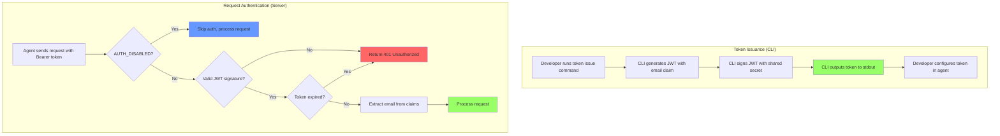

# User Story: Bearer Token Authentication

**Story ID**: CRONTY-5
**Created**: 2026-01-03

## User Persona

An AI agent developer deploying Cronty MCP to FastMCP Cloud who needs to authenticate clients that don't support OAuth 2.0 Dynamic Client Registration (e.g., Obsidian MCP plugin).

## Feature Statement

As an AI agent developer,
I want to protect my Cronty MCP server with bearer token authentication
so that only authorized clients can schedule notifications on my behalf.

## Flow Diagram



## Narrative

This story adds bearer token authentication to Cronty MCP, enabling secure access for clients that don't support OAuth 2.0 with Dynamic Client Registration. The implementation uses JWT tokens signed with a symmetric key (HS512), with the user's email encoded in the token claims.

### Why Bearer Tokens?

FastMCP Cloud provides built-in OAuth 2.0 authentication, but some MCP clients (like Obsidian's MCP plugin) only support simpler authentication methods:
- API Key in HTTP header
- Bearer token

Bearer tokens with JWT provide a good balance of security and simplicity, allowing the server to validate tokens without maintaining server-side state.

### Token Structure

Tokens are JWTs signed with HS512 containing:
- `sub` (subject): User's email address
- `iss` (issuer): `cronty-mcp`
- `iat` (issued at): Token creation timestamp
- `exp` (expiration): Token expiry (configurable, default 1 year)

Example decoded token:
```json
{
  "sub": "user@example.com",
  "iss": "cronty-mcp",
  "iat": 1735900800,
  "exp": 1767436800
}
```

### CLI Token Issuance

Tokens are issued via CLI command:

```bash
uv run python -m cronty token issue --email user@example.com
```

The CLI:
1. Reads `JWT_SECRET` from environment (or `.env` file)
2. Creates JWT with email as subject claim
3. Signs with HS512 algorithm
4. Outputs token to stdout

Optional flags:
- `--expires-in`: Token validity duration (default: `365d`)

### Server-Side Verification

The server uses FastMCP's `JWTVerifier` with symmetric key:

```python
from fastmcp.server.auth.providers.jwt import JWTVerifier

verifier = JWTVerifier(
    public_key=config.JWT_SECRET,
    issuer="cronty-mcp",
    algorithm="HS512"
)

mcp = FastMCP("Cronty MCP", auth=verifier)
```

### Authentication Toggle

Authentication is controlled by `AUTH_DISABLED` environment variable:
- Not set or `false`: Authentication required (default)
- `true`: Authentication disabled (for local development)

This allows developers to run the server locally without auth while requiring it in production deployments.

### Documentation Updates

The README will be updated with a new section showing how to configure agents to send bearer tokens. Existing configuration examples (without auth) will be preserved under a "Without Authentication" subsection for future OAuth support.

Agent configurations that support bearer tokens:
- Obsidian MCP plugin (native support)
- Direct HTTP clients (manual header)
- FastMCP Python client (auth parameter)

### Future: Email Allowlist

The email claim enables future authorization features:
- Environment variable allowlist (`ALLOWED_EMAILS=a@x.com,b@x.com`)
- Database-backed allowlist
- Domain-based restrictions (`*@company.com`)

This story only implements authentication (who are you?), not authorization (what can you do?).

## Non-functional Requirements

### Security

- JWT secret must be minimum 32 characters
- Tokens should have reasonable expiration (default 1 year)
- Secret should never be logged or exposed in error messages

### Error Handling

- Missing token returns 401 with clear message
- Invalid/expired token returns 401 without leaking validation details
- Missing JWT_SECRET at startup fails fast with configuration error

### Developer Experience

- Local development works without auth by setting `AUTH_DISABLED=true`
- Token issuance is a single command
- Token can be copied directly to agent configuration

## Acceptance Criteria

### Scenario: Issue token via CLI

```gherkin
Given JWT_SECRET is configured in environment
When I run "uv run python -m cronty token issue --email user@example.com"
Then a valid JWT token should be printed to stdout
And the token should contain the email as subject claim
And the token should be signed with HS512
And the token should expire in 1 year by default
```

### Scenario: Issue token with custom expiration

```gherkin
Given JWT_SECRET is configured in environment
When I run "uv run python -m cronty token issue --email user@example.com --expires-in 30d"
Then the token should expire in 30 days
```

### Scenario: Token issuance fails without secret

```gherkin
Given JWT_SECRET is not configured
When I run "uv run python -m cronty token issue --email user@example.com"
Then the command should exit with error
And the error should indicate JWT_SECRET is required
```

### Scenario: Authenticated request succeeds

```gherkin
Given the server is running with AUTH_DISABLED=false
And JWT_SECRET is configured
And I have a valid token for "user@example.com"
When I send a request with "Authorization: Bearer <token>"
Then the request should be processed successfully
```

### Scenario: Request without token fails

```gherkin
Given the server is running with AUTH_DISABLED=false
When I send a request without Authorization header
Then I should receive 401 Unauthorized
```

### Scenario: Request with invalid token fails

```gherkin
Given the server is running with AUTH_DISABLED=false
When I send a request with "Authorization: Bearer invalid-token"
Then I should receive 401 Unauthorized
```

### Scenario: Request with expired token fails

```gherkin
Given the server is running with AUTH_DISABLED=false
And I have an expired token
When I send a request with the expired token
Then I should receive 401 Unauthorized
```

### Scenario: Auth disabled allows unauthenticated requests

```gherkin
Given the server is running with AUTH_DISABLED=true
When I send a request without Authorization header
Then the request should be processed successfully
```

### Scenario: Server startup fails without JWT_SECRET when auth enabled

```gherkin
Given AUTH_DISABLED is not set or false
And JWT_SECRET is not configured
When the server starts
Then it should fail with configuration error
And the error should indicate JWT_SECRET is required
```

### Scenario: Server starts without JWT_SECRET when auth disabled

```gherkin
Given AUTH_DISABLED=true
And JWT_SECRET is not configured
When the server starts
Then it should start successfully
```

## Technical Notes

### New Environment Variables

| Variable | Description | Required |
|----------|-------------|----------|
| `JWT_SECRET` | Secret key for signing/verifying JWTs (min 32 chars) | Yes (when auth enabled) |
| `AUTH_DISABLED` | Set to `true` to disable authentication | No (default: false) |

### CLI Module Structure

```
cronty-mcp/
├── cronty/
│   ├── __init__.py
│   ├── __main__.py      # CLI entry point
│   └── cli/
│       ├── __init__.py
│       └── token.py     # Token issuance commands
├── server.py
├── config.py            # Add JWT_SECRET, AUTH_DISABLED
└── ...
```

### CLI Implementation

```python
# cronty/__main__.py
import argparse
from cronty.cli import token

def main():
    parser = argparse.ArgumentParser(prog="cronty")
    subparsers = parser.add_subparsers(dest="command")

    token.register(subparsers)

    args = parser.parse_args()
    if args.command == "token":
        token.handle(args)
    else:
        parser.print_help()

if __name__ == "__main__":
    main()
```

```python
# cronty/cli/token.py
import jwt
from datetime import datetime, timedelta, UTC
from config import get_jwt_secret

def register(subparsers):
    token_parser = subparsers.add_parser("token", help="Token management")
    token_sub = token_parser.add_subparsers(dest="token_command")

    issue_parser = token_sub.add_parser("issue", help="Issue a new token")
    issue_parser.add_argument("--email", required=True, help="User email")
    issue_parser.add_argument("--expires-in", default="365d", help="Expiration (e.g., 30d, 1y)")

def handle(args):
    if args.token_command == "issue":
        issue_token(args.email, args.expires_in)

def issue_token(email: str, expires_in: str):
    secret = get_jwt_secret()
    if not secret:
        print("Error: JWT_SECRET environment variable is required")
        exit(1)

    expiry = parse_duration(expires_in)

    payload = {
        "sub": email,
        "iss": "cronty-mcp",
        "iat": datetime.now(UTC),
        "exp": datetime.now(UTC) + expiry,
    }

    token = jwt.encode(payload, secret, algorithm="HS512")
    print(token)
```

### Server Auth Configuration

```python
# server.py
from dotenv import load_dotenv
from fastmcp import FastMCP

from config import is_auth_disabled, get_jwt_secret

load_dotenv()

def create_auth():
    if is_auth_disabled():
        return None

    from fastmcp.server.auth.providers.jwt import JWTVerifier

    secret = get_jwt_secret()
    if not secret:
        raise ValueError("JWT_SECRET is required when authentication is enabled")

    return JWTVerifier(
        public_key=secret,
        issuer="cronty-mcp",
        algorithm="HS512"
    )

mcp = FastMCP("Cronty MCP", auth=create_auth())
```

### Config Updates

```python
# config.py
import os

def get_jwt_secret() -> str | None:
    return os.getenv("JWT_SECRET")

def is_auth_disabled() -> bool:
    return os.getenv("AUTH_DISABLED", "").lower() == "true"

def get_missing_env_vars() -> list[str]:
    missing = []
    if not os.getenv("QSTASH_TOKEN"):
        missing.append("QSTASH_TOKEN")
    if not os.getenv("NTFY_TOPIC"):
        missing.append("NTFY_TOPIC")
    if not is_auth_disabled() and not get_jwt_secret():
        missing.append("JWT_SECRET")
    return missing
```

### Dependencies

Add to `pyproject.toml`:
```
pyjwt>=2.8.0
```

### README Documentation Updates

Add new section "Authentication" with subsections:
1. "Bearer Token Authentication" - how to issue tokens and configure agents
2. "Without Authentication (Local Development)" - existing configs with AUTH_DISABLED=true
3. "Agent Configuration with Bearer Token" - updated configs for each agent

Example Obsidian configuration:
```
Server URL: https://your-hostname.fastmcp.app/mcp
Authentication: Bearer Token
Token: <paste token from CLI>
```

Example FastMCP Cloud configs with bearer token for other agents.
