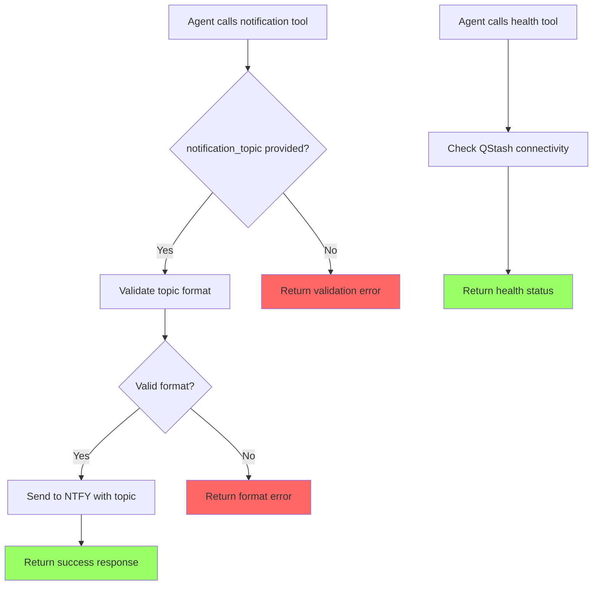

# User Story: Notification Topic as Tool Parameter

**Story ID**: CRONTY-6
**Created**: 2026-01-06

## User Persona

An AI agent developer integrating Cronty MCP into their application to provide notification scheduling for their users.

## Feature Statement

As an AI agent developer,
I want to specify the NTFY notification topic as a parameter on each tool call
so that I can use Cronty MCP without hardcoding a single topic, enabling multi-user and multi-tenant scenarios.

## Flow Diagram



## Narrative

Currently, Cronty MCP requires the `NTFY_TOPIC` environment variable to be set at server startup. This limits the server to a single notification destination, making it unsuitable for:

- Multi-user deployments where each user has their own NTFY topic
- Multi-tenant scenarios where different applications share the same MCP server
- Public deployments where users bring their own NTFY topics

This feature modifies all notification tools to accept `notification_topic` as a required parameter. The topic is passed through to the NTFY service on each request, allowing dynamic routing of notifications.

### Affected Tools

1. **send_push_notification** - Add required `notification_topic` parameter
2. **schedule_notification** - Add required `notification_topic` parameter
3. **schedule_cron_notification** - Add required `notification_topic` parameter

### Service Layer Changes

1. **services/ntfy.py** - Accept topic as function parameter instead of reading from environment
2. **services/qstash.py** - Accept topic as function parameter for URL construction

### Configuration Changes

1. Remove `NTFY_TOPIC` from `REQUIRED_ENV_VARS` in config.py
2. Remove `NTFY_TOPIC` from `.env.example`
3. Update health tool to only check QStash connectivity (no longer validates NTFY_TOPIC)

### Documentation Updates

1. **README.md** - Remove NTFY_TOPIC from environment setup, document the new parameter
2. **CLAUDE.md** - Update environment variables section
3. **PRD** - Update configuration table

### Breaking Change

This is a breaking change. Existing integrations will need to update their tool calls to include the `notification_topic` parameter.

## Non-functional Requirements

### Loading & Feedback

- Tool calls should fail fast with clear error messages when topic is missing
- No change to response time - topic validation is lightweight

### Error Handling

- Missing `notification_topic` returns clear validation error explaining the required parameter
- Invalid topic format (if NTFY has restrictions) returns descriptive error

### Reliability

- No impact on reliability - topic is passed through to NTFY as before
- QStash schedules continue to work with topic embedded in destination URL

## Acceptance Criteria

### Scenario: Developer sends push notification with topic

```gherkin
Given I have the MCP server running
And NTFY_TOPIC is not set in environment
When I call send_push_notification with message "Hello" and notification_topic "my-topic"
Then the notification should be sent to "my-topic"
And I should receive a success response
```

### Scenario: Developer schedules notification with topic

```gherkin
Given I have the MCP server running
When I call schedule_notification with message "Reminder", delay "1h", and notification_topic "user-123-alerts"
Then a QStash message should be scheduled targeting "https://ntfy.sh/user-123-alerts"
And I should receive a success response with message_id
```

### Scenario: Developer schedules cron notification with topic

```gherkin
Given I have the MCP server running
When I call schedule_cron_notification with message "Daily standup", cron "0 9 * * 1-5", timezone "America/New_York", and notification_topic "team-standup"
Then a QStash schedule should be created targeting "https://ntfy.sh/team-standup"
And I should receive a success response with schedule_id
```

### Scenario: Developer calls tool without topic

```gherkin
Given I have the MCP server running
When I call send_push_notification with message "Hello" but without notification_topic
Then I should receive a validation error
And the error should indicate that notification_topic is required
```

### Scenario: Health check without NTFY_TOPIC configured

```gherkin
Given I have the MCP server running
And NTFY_TOPIC is not set in environment
When I call the health tool
Then I should receive a success response
And the response should confirm QStash connectivity
And the response should not mention NTFY_TOPIC
```

### Scenario: Server starts without NTFY_TOPIC

```gherkin
Given QSTASH_TOKEN is set
And JWT_SECRET is set (or AUTH_DISABLED=true)
And NTFY_TOPIC is not set
When I start the MCP server
Then the server should start successfully
And the health tool should report healthy status
```
