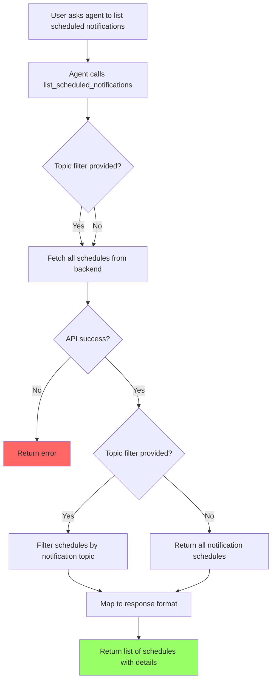

# User Story: List Scheduled Notifications

**Story ID**: CRONTY-7
**Created**: 2026-01-08

## User Persona

An end user interacting with an AI agent (Claude Code, Cursor, Obsidian Life Navigator) that has Cronty MCP configured.

## Feature Statement

As an end user,
I want to ask my AI agent to show me my scheduled notifications
so that I can see what recurring reminders are set up, when they'll fire, and what messages they contain.

## Flow Diagram



## Narrative

This story implements the P1 "Job Management" feature from the PRD. Users often set up recurring notifications and later need to review what's scheduled. This tool brings that visibility directly into the AI agent conversation.

### Topic Filtering

Filtering happens client-side after fetching all schedules:
- If `notification_topic` provided: return only schedules for that topic
- If no topic provided: return all notification schedules

This allows users to either see all their scheduled notifications or filter to a specific topic.

### Non-NTFY Schedule Handling

The backend may contain schedules targeting destinations other than ntfy.sh (e.g., webhooks, other services). These are silently skipped:
- Schedules without `ntfy.sh` in the destination URL are not included
- Schedules with malformed destination URLs are not included
- No error is raised - they simply don't appear in results

This ensures the tool only returns relevant notification schedules.

### Response Format

The tool returns a clean, implementation-agnostic response format:

```python
{
    "schedules": [
        {
            "schedule_id": "sched_abc123",
            "cron_expression": "0 9 * * 1",
            "timezone": "Europe/Warsaw",
            "notification_topic": "my-alerts",
            "label": "standup-reminder",
            "next_occurrence": "2026-01-13T09:00:00+01:00",
            "last_occurrence": "2026-01-06T09:00:00+01:00",
            "notification_body": "Weekly standup reminder"
        }
    ],
    "count": 1
}
```

| Field | Type | Description |
|-------|------|-------------|
| `schedule_id` | str | Unique identifier for the schedule |
| `cron_expression` | str | Standard 5-field cron expression |
| `timezone` | str | IANA timezone (extracted from cron, defaults to UTC) |
| `notification_topic` | str | The NTFY topic this schedule targets |
| `label` | str \| null | Optional human-readable label |
| `next_occurrence` | str \| null | ISO 8601 timestamp of next scheduled execution |
| `last_occurrence` | str \| null | ISO 8601 timestamp of last execution |
| `notification_body` | str \| null | The message text (null if unavailable) |

### Cron Expression Parsing

The backend stores cron with timezone prefix (e.g., `CRON_TZ=Europe/Warsaw 0 9 * * 1`). The service layer:
1. Extracts the timezone from `CRON_TZ=` prefix (defaults to "UTC" if not present)
2. Returns only the 5-field cron expression in `cron_expression`
3. Returns the timezone separately in `timezone` field

### Empty Results

If no schedules match the filter (or none exist), return an empty list with count 0. This is not an error condition.

## Non-functional Requirements

### Loading & Feedback

- Tool response should be immediate for typical schedule counts (< 100)
- No pagination in MVP - returns all matching schedules

### Error Handling

- Backend API errors are passed through with context
- Invalid topic format returns validation error
- Network timeouts return appropriate error message

### Reliability

- Read-only operation - no side effects on schedules
- Stale data is acceptable (schedules may change between list and user viewing)

## Acceptance Criteria

### Scenario: List all schedules without filter

```gherkin
Given the MCP server is running with valid configuration
And there are notification schedules configured
When the agent calls list_scheduled_notifications without topic filter
Then the tool should return all notification schedules
And each schedule should include schedule_id, cron_expression, timezone, notification_topic
And each schedule should include label, next_occurrence, last_occurrence
And each schedule should include notification_body when available
And the response should include a count of matching schedules
```

### Scenario: List schedules filtered by topic

```gherkin
Given the MCP server is running with valid configuration
And there are schedules for "my-alerts" and "other-topic"
When the agent calls list_scheduled_notifications with notification_topic "my-alerts"
Then the tool should return only schedules for "my-alerts"
And schedules for other topics should not be included
```

### Scenario: No matching schedules

```gherkin
Given the MCP server is running with valid configuration
And there are no schedules for "nonexistent-topic"
When the agent calls list_scheduled_notifications with notification_topic "nonexistent-topic"
Then the tool should return an empty list
And the count should be 0
And this should not be treated as an error
```

### Scenario: Schedule with unavailable notification body

```gherkin
Given the MCP server is running with valid configuration
And a schedule exists where the notification body is not available
When the agent calls list_scheduled_notifications
Then the schedule should be included in results
And the notification_body field should be null
```

### Scenario: Backend API error

```gherkin
Given the MCP server is running
But the backend API is unavailable or returns an error
When the agent calls list_scheduled_notifications
Then the tool should return an error
And the error should include context about the failure
```

### Scenario: Invalid topic format

```gherkin
Given the MCP server is running
When the agent calls list_scheduled_notifications with notification_topic "INVALID TOPIC!"
Then the tool should return a validation error
And the error should indicate the topic format requirements
```

### Scenario: Non-NTFY schedules are excluded

```gherkin
Given the MCP server is running with valid configuration
And there are schedules targeting "https://ntfy.sh/my-alerts"
And there are schedules targeting "https://example.com/webhook"
And there are schedules targeting "https://other-service.io/notify"
When the agent calls list_scheduled_notifications
Then the tool should return only schedules targeting ntfy.sh
And schedules targeting other destinations should be silently excluded
And no error should be raised for non-NTFY schedules
```

### Scenario: Malformed destination URL is skipped

```gherkin
Given the MCP server is running with valid configuration
And a schedule exists with destination "not-a-valid-url"
And a schedule exists with destination "https://ntfy.sh/valid-topic"
When the agent calls list_scheduled_notifications
Then the malformed schedule should be silently excluded
And the valid NTFY schedule should be returned
And no error should be raised
```

## Technical Notes

### Tool Signature

```python
from typing import Annotated
from pydantic import Field

@mcp.tool
def list_scheduled_notifications(
    notification_topic: Annotated[
        str | None,
        Field(
            default=None,
            description=(
                "Optional: filter to show only schedules for this notification topic. "
                "If not provided, returns all scheduled notifications. "
                "Format: lowercase alphanumeric with dashes (e.g., 'my-alerts')"
            ),
            pattern=r"^[a-z0-9]+(-[a-z0-9]+)*$",
        ),
    ] = None,
) -> dict:
    """List scheduled recurring notifications.

    Returns all recurring cron notification schedules.
    Optionally filter by a specific notification topic.

    Note: One-off scheduled notifications (created with schedule_notification)
    are not included as they are pending messages, not recurring schedules.
    """
```

### Service Layer

```python
# services/qstash.py

def list_schedules(topic: str | None = None) -> list[dict]:
    """List all notification schedules.

    Args:
        topic: Optional topic to filter by.

    Returns:
        List of schedule dictionaries with mapped fields.
    """
    client = QStash(token=os.environ["QSTASH_TOKEN"])
    schedules = client.schedule.list()

    results = []
    for schedule in schedules:
        if "ntfy.sh" not in schedule.destination:
            continue

        schedule_topic = schedule.destination.split("ntfy.sh/")[-1]

        if topic is not None and schedule_topic != topic:
            continue

        cron_expression, timezone = _parse_cron(schedule.cron)

        results.append({
            "schedule_id": schedule.schedule_id,
            "cron_expression": cron_expression,
            "timezone": timezone,
            "notification_topic": schedule_topic,
            "label": schedule.label,
            "next_occurrence": _format_timestamp(schedule.next_schedule_time),
            "last_occurrence": _format_timestamp(schedule.last_schedule_time),
            "notification_body": schedule.body,
        })

    return results


def _parse_cron(cron: str) -> tuple[str, str]:
    """Parse cron string to extract expression and timezone.

    Args:
        cron: Cron string, optionally with CRON_TZ prefix.

    Returns:
        Tuple of (cron_expression, timezone).
    """
    if cron.startswith("CRON_TZ="):
        parts = cron.split(" ", 1)
        timezone = parts[0].replace("CRON_TZ=", "")
        cron_expression = parts[1] if len(parts) > 1 else ""
        return cron_expression, timezone
    return cron, "UTC"


def _format_timestamp(ts: int | None) -> str | None:
    """Convert Unix timestamp to ISO 8601 format."""
    if ts is None:
        return None
    from datetime import datetime, timezone
    return datetime.fromtimestamp(ts, tz=timezone.utc).isoformat()
```

### Project Structure Update

```
cronty-mcp/
├── server.py
├── config.py
├── tools/
│   ├── __init__.py
│   ├── health.py
│   ├── schedule.py              # Add list_scheduled_notifications
│   └── push_notification.py
├── services/
│   ├── __init__.py
│   ├── qstash.py                # Add list_schedules function
│   └── ntfy.py
└── tests/
    ├── test_health.py
    ├── test_schedule.py         # Add list tests
    └── test_push_notification.py
```

### Test Coverage

Unit tests should cover the service layer functions with mocked QStash responses.

```python
# tests/test_schedule.py

import pytest
from unittest.mock import MagicMock, patch
from services.qstash import list_schedules, _parse_cron, _format_timestamp


class TestListSchedules:
    @patch("services.qstash.QStash")
    def test_list_schedules_returns_ntfy_schedules(self, mock_qstash_class):
        mock_schedule = MagicMock()
        mock_schedule.schedule_id = "sched_123"
        mock_schedule.destination = "https://ntfy.sh/my-topic"
        mock_schedule.cron = "CRON_TZ=Europe/Warsaw 0 9 * * 1"
        mock_schedule.body = "Test message"
        mock_schedule.label = "test-label"
        mock_schedule.next_schedule_time = 1736330400
        mock_schedule.last_schedule_time = 1735725600

        mock_client = MagicMock()
        mock_client.schedule.list.return_value = [mock_schedule]
        mock_qstash_class.return_value = mock_client

        result = list_schedules()

        assert len(result) == 1
        assert result[0]["schedule_id"] == "sched_123"
        assert result[0]["cron_expression"] == "0 9 * * 1"
        assert result[0]["timezone"] == "Europe/Warsaw"
        assert result[0]["notification_topic"] == "my-topic"
        assert result[0]["notification_body"] == "Test message"
        assert result[0]["label"] == "test-label"

    @patch("services.qstash.QStash")
    def test_list_schedules_filters_by_topic(self, mock_qstash_class):
        mock_schedule_1 = MagicMock()
        mock_schedule_1.destination = "https://ntfy.sh/topic-a"
        mock_schedule_1.schedule_id = "sched_1"
        mock_schedule_1.cron = "0 9 * * 1"
        mock_schedule_1.body = None
        mock_schedule_1.label = None
        mock_schedule_1.next_schedule_time = None
        mock_schedule_1.last_schedule_time = None

        mock_schedule_2 = MagicMock()
        mock_schedule_2.destination = "https://ntfy.sh/topic-b"
        mock_schedule_2.schedule_id = "sched_2"
        mock_schedule_2.cron = "0 10 * * 1"
        mock_schedule_2.body = None
        mock_schedule_2.label = None
        mock_schedule_2.next_schedule_time = None
        mock_schedule_2.last_schedule_time = None

        mock_client = MagicMock()
        mock_client.schedule.list.return_value = [mock_schedule_1, mock_schedule_2]
        mock_qstash_class.return_value = mock_client

        result = list_schedules(topic="topic-a")

        assert len(result) == 1
        assert result[0]["notification_topic"] == "topic-a"

    @patch("services.qstash.QStash")
    def test_list_schedules_excludes_non_ntfy_destinations(self, mock_qstash_class):
        mock_ntfy = MagicMock()
        mock_ntfy.destination = "https://ntfy.sh/my-topic"
        mock_ntfy.schedule_id = "sched_ntfy"
        mock_ntfy.cron = "0 9 * * 1"
        mock_ntfy.body = "NTFY message"
        mock_ntfy.label = None
        mock_ntfy.next_schedule_time = None
        mock_ntfy.last_schedule_time = None

        mock_webhook = MagicMock()
        mock_webhook.destination = "https://example.com/webhook"
        mock_webhook.schedule_id = "sched_webhook"

        mock_other = MagicMock()
        mock_other.destination = "https://other-service.io/notify"
        mock_other.schedule_id = "sched_other"

        mock_client = MagicMock()
        mock_client.schedule.list.return_value = [mock_ntfy, mock_webhook, mock_other]
        mock_qstash_class.return_value = mock_client

        result = list_schedules()

        assert len(result) == 1
        assert result[0]["schedule_id"] == "sched_ntfy"

    @patch("services.qstash.QStash")
    def test_list_schedules_excludes_malformed_destinations(self, mock_qstash_class):
        mock_valid = MagicMock()
        mock_valid.destination = "https://ntfy.sh/valid-topic"
        mock_valid.schedule_id = "sched_valid"
        mock_valid.cron = "0 9 * * 1"
        mock_valid.body = "Valid"
        mock_valid.label = None
        mock_valid.next_schedule_time = None
        mock_valid.last_schedule_time = None

        mock_malformed = MagicMock()
        mock_malformed.destination = "not-a-valid-url"
        mock_malformed.schedule_id = "sched_malformed"

        mock_client = MagicMock()
        mock_client.schedule.list.return_value = [mock_valid, mock_malformed]
        mock_qstash_class.return_value = mock_client

        result = list_schedules()

        assert len(result) == 1
        assert result[0]["schedule_id"] == "sched_valid"

    @patch("services.qstash.QStash")
    def test_list_schedules_returns_empty_list_when_no_matches(self, mock_qstash_class):
        mock_client = MagicMock()
        mock_client.schedule.list.return_value = []
        mock_qstash_class.return_value = mock_client

        result = list_schedules()

        assert result == []

    @patch("services.qstash.QStash")
    def test_list_schedules_handles_null_body(self, mock_qstash_class):
        mock_schedule = MagicMock()
        mock_schedule.destination = "https://ntfy.sh/my-topic"
        mock_schedule.schedule_id = "sched_123"
        mock_schedule.cron = "0 9 * * 1"
        mock_schedule.body = None
        mock_schedule.label = None
        mock_schedule.next_schedule_time = None
        mock_schedule.last_schedule_time = None

        mock_client = MagicMock()
        mock_client.schedule.list.return_value = [mock_schedule]
        mock_qstash_class.return_value = mock_client

        result = list_schedules()

        assert len(result) == 1
        assert result[0]["notification_body"] is None


class TestParseCron:
    def test_parse_cron_with_timezone(self):
        cron_expression, timezone = _parse_cron("CRON_TZ=Europe/Warsaw 0 9 * * 1")
        assert cron_expression == "0 9 * * 1"
        assert timezone == "Europe/Warsaw"

    def test_parse_cron_without_timezone(self):
        cron_expression, timezone = _parse_cron("0 9 * * 1")
        assert cron_expression == "0 9 * * 1"
        assert timezone == "UTC"

    def test_parse_cron_with_utc_timezone(self):
        cron_expression, timezone = _parse_cron("CRON_TZ=UTC 30 8 * * 1-5")
        assert cron_expression == "30 8 * * 1-5"
        assert timezone == "UTC"

    def test_parse_cron_with_complex_expression(self):
        cron_expression, timezone = _parse_cron("CRON_TZ=America/New_York 0 0 1 * *")
        assert cron_expression == "0 0 1 * *"
        assert timezone == "America/New_York"


class TestFormatTimestamp:
    def test_format_timestamp_valid(self):
        result = _format_timestamp(1736330400)
        assert result == "2025-01-08T10:00:00+00:00"

    def test_format_timestamp_none(self):
        result = _format_timestamp(None)
        assert result is None

    def test_format_timestamp_zero(self):
        result = _format_timestamp(0)
        assert result == "1970-01-01T00:00:00+00:00"
```

### Evaluation Test

The evaluation test should be self-contained:
1. Create a labeled cron schedule with a unique identifier
2. Call list_scheduled_notifications
3. Verify the created schedule appears in the results
4. Verify schedule_id, cron_expression, and notification_body are returned

Note: The created schedule will persist after the test. Consider using a distinctive label for cleanup.

## Evaluation XML Addition

Added to `evaluation.xml`:

```xml
<qa_pair>
    <question>
        First, schedule a cron notification with the message "List test scheduled at {current_time}"
        to topic "cronty-eval-test" with cron expression "0 0 1 1 *" (yearly on Jan 1st) in UTC timezone
        and label "eval-list-test".
        Replace the `{current_time}` placeholder with the current time in UTC.

        Then, call the list_scheduled_notifications tool to retrieve all schedules for topic "cronty-eval-test".

        Does the list include a schedule with the label "eval-list-test" and does the response show
        the schedule_id, cron_expression, and notification_body for that schedule? Answer: Yes or No.
    </question>
    <answer>Yes</answer>
</qa_pair>
```
