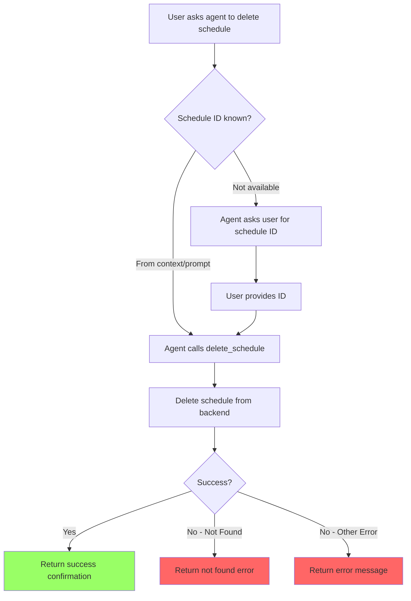

# User Story: Delete Schedule

**Story ID**: CRONTY-8
**Created**: 2026-01-08

## User Persona

An end user interacting with an AI agent (Claude Code, Cursor, Obsidian Life Navigator) that has Cronty MCP configured.

## Feature Statement

As an end user,
I want to ask my AI agent to delete a scheduled notification by its ID
so that I can cancel recurring notifications I no longer need.

## Flow Diagram



## Narrative

This story implements schedule deletion, a P1 feature from the PRD. When a user says "cancel my weekly reminder" or "delete the schedule with ID scd_123," the AI agent calls the delete_schedule tool.

### Schedule ID

Schedule IDs are returned when creating cron schedules via `schedule_cron_notification`.

The agent should use the schedule ID from:
1. **Conversation context** - If the user just created a schedule, use the returned ID
2. **User's prompt** - If the user provides the ID directly (e.g., "delete schedule scd_abc123")
3. **Ask only if unavailable** - Only prompt the user for the ID when it cannot be determined from context

The tool does not validate the ID format locally - it delegates validation to the backend service.

### Error Handling

When deleting a non-existent schedule, the tool returns a result with `success: false` and an error message. This is not an exception - it's a normal response that the agent can interpret. This helps users understand that:
- The schedule may have already been deleted
- The ID might be incorrect

### Response Format

On successful deletion:

```json
{
  "success": true,
  "schedule_id": "scd_abc123",
  "confirmation": "Schedule scd_abc123 deleted successfully"
}
```

On error (e.g., schedule not found):

```json
{
  "success": false,
  "schedule_id": "scd_abc123",
  "error": "Schedule not found: scd_abc123. It may have already been deleted or the ID is incorrect."
}
```

| Field | Type | Description |
|-------|------|-------------|
| `success` | `boolean` | Whether the deletion succeeded |
| `schedule_id` | `string` | The ID of the schedule |
| `confirmation` | `string` | Human-readable confirmation message (success only) |
| `error` | `string` | Human-readable error message (failure only) |

## Non-functional Requirements

### Loading & Feedback

- Tool response should be immediate
- Success confirmation should include the deleted schedule ID

### Error Handling

- Non-existent schedule returns clear "not found" error
- Backend errors are mapped to user-friendly messages
- No local ID format validation (delegate to backend)

### Reliability

- Delete operation returns not found on subsequent calls
- No data loss risk - only removes the schedule, not historical execution logs

## Acceptance Criteria

### Scenario: Delete existing schedule

```gherkin
Given the MCP server is running with valid configuration
And a cron schedule exists with ID "scd_abc123"
When the agent calls delete_schedule with:
  | Parameter   | Value       |
  | schedule_id | scd_abc123  |
Then the tool should return a success response
And the response should include the deleted schedule ID
And the schedule should no longer exist
```

### Scenario: Delete non-existent schedule

```gherkin
Given the MCP server is running with valid configuration
And no schedule exists with ID "scd_nonexistent"
When the agent calls delete_schedule with:
  | Parameter   | Value           |
  | schedule_id | scd_nonexistent |
Then the tool should return an error
And the error should indicate the schedule was not found
```

### Scenario: Delete with invalid ID format

```gherkin
Given the MCP server is running with valid configuration
When the agent calls delete_schedule with:
  | Parameter   | Value          |
  | schedule_id | invalid-id-123 |
Then the tool should return an appropriate error
And the error should be passed through to the agent
```

### Scenario: Missing schedule ID parameter

```gherkin
Given the MCP server is running
When the agent calls delete_schedule without a schedule_id
Then the tool should return a validation error
And the error should indicate schedule_id is required
```

## Technical Notes

### Tool Signature

```python
from typing import Annotated
from pydantic import Field

def delete_schedule(
    schedule_id: Annotated[
        str,
        Field(
            description=(
                "The schedule ID to delete. "
                "This ID is returned when creating a cron schedule."
            )
        ),
    ],
) -> dict:
    """Delete a scheduled notification by its ID.

    Permanently removes a cron schedule. The schedule will stop firing
    and cannot be recovered. Use the schedule_id returned from
    schedule_cron_notification.
    """
```

### Result Type

Uses a proper `Result` type (`services/result.py`) instead of exceptions for expected errors:

```python
@dataclass(frozen=True, slots=True)
class Ok[T]:
    value: T

    @property
    def is_ok(self) -> bool:
        return True

    @property
    def is_err(self) -> bool:
        return False

@dataclass(frozen=True, slots=True)
class Err:
    code: str
    message: str = ""

    @property
    def is_ok(self) -> bool:
        return False

    @property
    def is_err(self) -> bool:
        return True

type Result[T] = Ok[T] | Err
```

### Service Layer

Add to `services/qstash.py` using Result pattern:

```python
from services.result import Err, Ok, Result

def delete_schedule(schedule_id: str) -> Result[None]:
    client = QStash(token=os.environ["QSTASH_TOKEN"])

    try:
        client.schedule.get(schedule_id)
    except Exception as e:
        error_msg = str(e).lower()
        if "not found" in error_msg or "404" in error_msg:
            return Err("not_found")
        return Err("api_error", str(e))

    try:
        client.schedule.delete(schedule_id)
    except Exception as e:
        return Err("api_error", str(e))

    return Ok(None)
```

### Tool Implementation

```python
from services.qstash import delete_schedule as qstash_delete

def delete_schedule(schedule_id: ...):
    result = qstash_delete(schedule_id)

    if result.is_ok:
        return {"success": True, "schedule_id": schedule_id, ...}

    if result.code == "not_found":
        return {"success": False, "schedule_id": schedule_id, "error": "..."}

    return {"success": False, "schedule_id": schedule_id, "error": result.message}
```

### Project Structure Update

```
cronty-mcp/
├── tools/
│   └── schedule.py           # Add delete_schedule
├── services/
│   ├── result.py             # Result type (Ok/Err)
│   └── qstash.py             # Add delete_schedule function
└── tests/
    └── test_schedule.py      # Add delete tests
```

## Evaluation Test Cases

Add to `evaluation.xml`:

### Test 1: Full delete flow (create then delete)

```xml
<qa_pair>
    <question>
        Create a cron schedule with message "Delete test {current_time}" to topic "cronty-eval-test"
        that runs every day at midnight UTC (cron: 0 0 * * *).
        Then immediately delete the schedule using the returned schedule ID.
        Was the schedule created and then deleted successfully? Answer: Yes or No.
    </question>
    <answer>Yes</answer>
</qa_pair>
```

### Test 2: Delete non-existent schedule

```xml
<qa_pair>
    <question>
        Try to delete a schedule with ID "scd_nonexistent_test_id".
        Did the deletion fail with a "not found" error? Answer: Yes or No.
    </question>
    <answer>Yes</answer>
</qa_pair>
```
