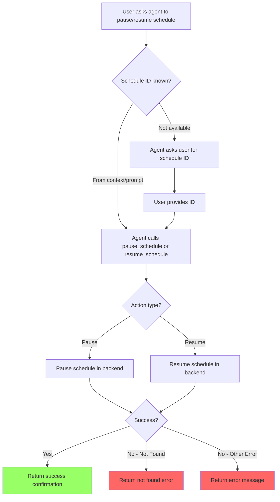

# User Story: Pause and Resume Schedule

**Story ID**: CRONTY-9
**Created**: 2026-01-09

## User Persona

An end user interacting with an AI agent (Claude Code, Cursor, Obsidian Life Navigator) that has Cronty MCP configured.

## Feature Statement

As an end user,
I want to ask my AI agent to pause and resume scheduled notifications
so that I can temporarily stop recurring notifications without deleting them.

## Flow Diagram



## Narrative

This story implements schedule pausing and resuming as two separate tools: `pause_schedule` and `resume_schedule`. This follows the same pattern as `delete_schedule` (CRONTY-8) and provides a reversible way to temporarily disable recurring notifications.

### Use Cases

- **Vacation mode**: User going on holiday can pause all reminders, then resume when back
- **Temporary silence**: Pause a noisy schedule during a meeting or focus time
- **Testing**: Pause a schedule while debugging without losing the configuration

### Schedule ID

Schedule IDs are returned when creating cron schedules via `schedule_cron_notification`.

The agent should use the schedule ID from:
1. **Conversation context** - If the user just created a schedule, use the returned ID
2. **User's prompt** - If the user provides the ID directly (e.g., "pause schedule scd_abc123")
3. **List schedules** - Agent can call `list_scheduled_notifications` to show schedules and let user choose
4. **Ask only if unavailable** - Only prompt the user for the ID when it cannot be determined from context

### Pause Behavior

According to QStash documentation:
- Pausing a schedule does not change the next scheduled delivery time
- The delivery will simply be ignored while paused
- If the schedule is already paused, calling pause again has no effect

### Resume Behavior

- Resuming a paused schedule makes it active again
- The next scheduled delivery will occur at the originally planned time
- If the schedule is already active, calling resume has no effect

### Error Handling

When pausing or resuming a non-existent schedule, the tool returns a result with `success: false` and an error message. This helps users understand:
- The schedule may have been deleted
- The ID might be incorrect

### Response Format

On successful pause:

```json
{
  "success": true,
  "schedule_id": "scd_abc123",
  "paused": true,
  "confirmation": "Schedule scd_abc123 paused successfully"
}
```

On successful resume:

```json
{
  "success": true,
  "schedule_id": "scd_abc123",
  "paused": false,
  "confirmation": "Schedule scd_abc123 resumed successfully"
}
```

On error (e.g., schedule not found):

```json
{
  "success": false,
  "schedule_id": "scd_abc123",
  "error": "Schedule not found: scd_abc123. It may have been deleted or the ID is incorrect."
}
```

| Field | Type | Description |
|-------|------|-------------|
| `success` | `boolean` | Whether the operation succeeded |
| `schedule_id` | `string` | The ID of the schedule |
| `paused` | `boolean` | Current paused state (success only) |
| `confirmation` | `string` | Human-readable confirmation message (success only) |
| `error` | `string` | Human-readable error message (failure only) |

### List Schedules Enhancement

The `list_scheduled_notifications` tool should include the `paused` state in its output so users can see which schedules are currently paused.

## Non-functional Requirements

### Loading & Feedback

- Tool response should be immediate
- Success confirmation should include the schedule ID and new paused state

### Error Handling

- Non-existent schedule returns clear "not found" error
- Backend errors are mapped to user-friendly messages
- No local ID format validation (delegate to backend)
- Idempotent operations (pausing already-paused schedule succeeds silently)

### Reliability

- Pause/resume operations are idempotent
- State is persisted in QStash backend
- No data loss - schedule configuration is preserved

## Acceptance Criteria

### Scenario: Pause an active schedule

```gherkin
Given the MCP server is running with valid configuration
And a cron schedule exists with ID "scd_abc123" that is active
When the agent calls pause_schedule with:
  | Parameter   | Value       |
  | schedule_id | scd_abc123  |
Then the tool should return a success response
And the response should include "paused": true
And the schedule should not fire until resumed
```

### Scenario: Resume a paused schedule

```gherkin
Given the MCP server is running with valid configuration
And a cron schedule exists with ID "scd_abc123" that is paused
When the agent calls resume_schedule with:
  | Parameter   | Value       |
  | schedule_id | scd_abc123  |
Then the tool should return a success response
And the response should include "paused": false
And the schedule should resume firing at its next scheduled time
```

### Scenario: Pause an already paused schedule (idempotent)

```gherkin
Given the MCP server is running with valid configuration
And a cron schedule exists with ID "scd_abc123" that is already paused
When the agent calls pause_schedule with:
  | Parameter   | Value       |
  | schedule_id | scd_abc123  |
Then the tool should return a success response
And the response should include "paused": true
```

### Scenario: Resume an already active schedule (idempotent)

```gherkin
Given the MCP server is running with valid configuration
And a cron schedule exists with ID "scd_abc123" that is already active
When the agent calls resume_schedule with:
  | Parameter   | Value       |
  | schedule_id | scd_abc123  |
Then the tool should return a success response
And the response should include "paused": false
```

### Scenario: Pause non-existent schedule

```gherkin
Given the MCP server is running with valid configuration
And no schedule exists with ID "scd_nonexistent"
When the agent calls pause_schedule with:
  | Parameter   | Value           |
  | schedule_id | scd_nonexistent |
Then the tool should return an error
And the error should indicate the schedule was not found
```

### Scenario: Resume non-existent schedule

```gherkin
Given the MCP server is running with valid configuration
And no schedule exists with ID "scd_nonexistent"
When the agent calls resume_schedule with:
  | Parameter   | Value           |
  | schedule_id | scd_nonexistent |
Then the tool should return an error
And the error should indicate the schedule was not found
```

### Scenario: Missing schedule ID parameter

```gherkin
Given the MCP server is running
When the agent calls pause_schedule without a schedule_id
Then the tool should return a validation error
And the error should indicate schedule_id is required
```

### Scenario: List schedules shows paused state

```gherkin
Given the MCP server is running with valid configuration
And a cron schedule exists with ID "scd_abc123" that is paused
When the agent calls list_scheduled_notifications
Then the response should include the schedule
And the schedule should have "paused": true
```

## Technical Notes

### Tool Signatures

```python
from typing import Annotated
from pydantic import Field

def pause_schedule(
    schedule_id: Annotated[
        str,
        Field(
            description=(
                "The schedule ID to pause. "
                "This ID is returned when creating a cron schedule."
            )
        ),
    ],
) -> dict:
    """Pause a scheduled notification.

    Temporarily stops a cron schedule from firing. The schedule configuration
    is preserved and can be resumed later. Use the schedule_id returned from
    schedule_cron_notification.
    """


def resume_schedule(
    schedule_id: Annotated[
        str,
        Field(
            description=(
                "The schedule ID to resume. "
                "This ID is returned when creating a cron schedule."
            )
        ),
    ],
) -> dict:
    """Resume a paused scheduled notification.

    Reactivates a paused cron schedule. The schedule will resume firing
    at its next scheduled time. Use the schedule_id returned from
    schedule_cron_notification.
    """
```

### Service Layer

Add to `services/qstash.py` using Result pattern:

```python
from services.result import Err, Ok, Result

def pause_schedule(schedule_id: str) -> Result[bool]:
    """Pause a schedule.

    Returns:
        Ok(True) on success (paused state), or Err with code and message on failure.
        Error codes: "not_found", "api_error"
    """
    client = QStash(token=os.environ["QSTASH_TOKEN"])

    try:
        client.schedule.get(schedule_id)
    except Exception as e:
        error_msg = str(e).lower()
        if "not found" in error_msg or "404" in error_msg:
            return Err("not_found")
        return Err("api_error", str(e))

    try:
        client.schedule.pause(schedule_id)
    except Exception as e:
        return Err("api_error", str(e))

    return Ok(True)


def resume_schedule(schedule_id: str) -> Result[bool]:
    """Resume a schedule.

    Returns:
        Ok(False) on success (not paused state), or Err with code and message on failure.
        Error codes: "not_found", "api_error"
    """
    client = QStash(token=os.environ["QSTASH_TOKEN"])

    try:
        client.schedule.get(schedule_id)
    except Exception as e:
        error_msg = str(e).lower()
        if "not found" in error_msg or "404" in error_msg:
            return Err("not_found")
        return Err("api_error", str(e))

    try:
        client.schedule.resume(schedule_id)
    except Exception as e:
        return Err("api_error", str(e))

    return Ok(False)
```

### Tool Implementation

```python
from services.qstash import pause_schedule as qstash_pause
from services.qstash import resume_schedule as qstash_resume

def pause_schedule(schedule_id: ...):
    result = qstash_pause(schedule_id)

    if result.is_ok:
        return {
            "success": True,
            "schedule_id": schedule_id,
            "paused": True,
            "confirmation": f"Schedule {schedule_id} paused successfully",
        }

    if result.code == "not_found":
        return {
            "success": False,
            "schedule_id": schedule_id,
            "error": f"Schedule not found: {schedule_id}. It may have been deleted or the ID is incorrect.",
        }

    return {"success": False, "schedule_id": schedule_id, "error": result.message}


def resume_schedule(schedule_id: ...):
    result = qstash_resume(schedule_id)

    if result.is_ok:
        return {
            "success": True,
            "schedule_id": schedule_id,
            "paused": False,
            "confirmation": f"Schedule {schedule_id} resumed successfully",
        }

    if result.code == "not_found":
        return {
            "success": False,
            "schedule_id": schedule_id,
            "error": f"Schedule not found: {schedule_id}. It may have been deleted or the ID is incorrect.",
        }

    return {"success": False, "schedule_id": schedule_id, "error": result.message}
```

### Update list_schedules

Update `services/qstash.py` `list_schedules` to include paused state:

```python
results.append(
    {
        "schedule_id": schedule.schedule_id,
        "cron_expression": cron_expression,
        "timezone": tz,
        "notification_topic": schedule_topic,
        "label": schedule.label,
        "paused": schedule.paused,  # Add this field
        "next_occurrence": _format_timestamp(schedule.next_schedule_time),
        "last_occurrence": _format_timestamp(schedule.last_schedule_time),
        "notification_body": schedule.body,
    }
)
```

### Project Structure Update

```
cronty-mcp/
├── tools/
│   └── schedule.py           # Add pause_schedule, resume_schedule
├── services/
│   └── qstash.py             # Add pause_schedule, resume_schedule functions
│                             # Update list_schedules to include paused field
└── tests/
    └── test_schedule.py      # Add pause/resume tests
```

## Evaluation Test Cases

Add to `evaluation.xml`:

### Test 1: Full pause/resume flow (create, pause, resume, delete)

```xml
<qa_pair>
    <question>
        Create a cron schedule with message "Pause test {current_time}" to topic "cronty-eval-test"
        that runs every day at midnight UTC (cron: 0 0 * * *).
        Then pause the schedule, then resume it, then delete it.
        Did all operations (create, pause, resume, delete) succeed? Answer: Yes or No.
    </question>
    <answer>Yes</answer>
</qa_pair>
```

### Test 2: Pause non-existent schedule

```xml
<qa_pair>
    <question>
        Try to pause a schedule with ID "scd_nonexistent_pause_test".
        Did the pause fail with a "not found" error? Answer: Yes or No.
    </question>
    <answer>Yes</answer>
</qa_pair>
```

### Test 3: List shows paused state

```xml
<qa_pair>
    <question>
        Create a cron schedule with message "Paused list test {current_time}" to topic "cronty-eval-test"
        that runs every day at midnight UTC (cron: 0 0 * * *).
        Pause the schedule, then list all schedules.
        Does the list show the schedule with paused=true? Answer: Yes or No.
        Then delete the schedule to clean up.
    </question>
    <answer>Yes</answer>
</qa_pair>
```
